# Bootstrap 3学习

> zzc
>
> 参考地址：[bootstrap项目实战：快速构建响应式网页](http://www.php.cn/course/988.html)

## demo1 展示页面

### 1 准备

Bootstrap下载地址：http://www.bootcss.com/

开发工具：webstorm

将Bootstrap中的css、js、fonts文件复制到项目中。将jQuery的js文件放入到js中

**所有的笔记都记录在代码中，用注释的形式表示出来了**

### 2 导航栏的制作

```html
<!--2 导航栏的制作-->
<!DOCTYPE html>
<html lang="zh-CH">

<head>
  <meta charset="UTF-8">
  <meta http-equiv="x-ua-compatible" content="IE=edge">
  <meta name="viewport" content="width=device-width, initial-scale=1, user-scalable=no">
  <title>bootstrap实战</title>
  <link rel="stylesheet" href="./css/bootstrap.min.css"/>
  <!--自定义了一个css文件，用于覆盖Bootstrap中的样式-->
  <link rel="stylesheet" href="css/bootstrap-index.css"/>
</head>

<body>
  <!--导航-->
  <nav class="navbar navbar-default navbar-fixed-top">
    <div class="container">
      <!--小屏幕导航按钮和logo-->
      <!--这个div必须要添加，用于下文的导航进行分割-->
      <div class="navbar-header">
        <!--只有navbar-toggle样式的button是不能点击-->
        <!--需要添加样式的绑定data-target，绑定的样式是下面的class-->
        <button class="navbar-toggle" data-toggle="collapse" data-target=".navbar-collapse">
          <!--incon-bar有几个就会有个按钮线-->
          <span class="icon-bar"></span>
          <span class="icon-bar"></span>
          <span class="icon-bar"></span>
        </button>
        <!--logo的设置-->
        <a href="index.html" class="navbar-brand">学院</a>
      </div>
      <!--小屏幕导航按钮和logo-->

      <!--右边导航-->
      <div class="navbar-collapse collapse">
        <!--添加了nav之后，li的样式被取消了-->
        <ul class="nav navbar-nav navbar-right">
          <!--快捷键li>a+tab-->
          <!--快捷键复制 crtl+D-->
          <!--#home 会寻找到当前页面下id="home"的位置，点击之后自动滚动到该位置-->
          <li><a href="#home">首页</a></li>
          <li><a href="index.html">论坛</a></li>
          <li><a href="index.html">前端开发</a></li>
          <li><a href="index.html">最新课程</a></li>
          <li><a href="index.html">移动app</a></li>
          <li><a href="index.html">联系我们</a></li>
        </ul>
      </div>
      <!--右边导航-->
    </div>
  </nav>
  <!--导航-->
  <!--2 导航栏的制作-->

  <!--注意，jQuery一定要在Bootstrap之前，这是因为Bootstrap使用了jQuery-->
  <script src="./js/jquery.min.js"></script>
  <script src="./js/bootstrap.min.js"></script>
</body>
</html>
```

自定义了一个bootstrap-index-top.css样式，用于修改Bootstrap的原生样式。修改样式的时候可以多加利用浏览器的审查元素功能。这样可以让劳动事半功倍。

```css
/*2 导航栏的实现*/
/*样式的调整可以通过F12进行样式选择，然后找到对应的选择器或者标签进行实时修改。*/
body{
  font-family: 'Microsoft YaHei', sans-serif;
}
.navbar-default{
  background-color: #fff;
  border: none;
  box-shadow: 0 2px 8px 0 rgba(50,50,50,0.25);
}
.navbar-default .navbar-brand {
  font-size: 30px;
  font-weight: bold;
  color: #40D2B1;
  height: 70px;
  line-height: 35px;
}
.navbar-default .navbar-nav>li>a {
  font-size: 16px;
  font-weight: bold;
  color: #666;
  height: 70px;
  line-height: 35px;
}
.navbar-toggle{
  margin-top: 17px;
}
/*hover的作用是在于鼠标指向的时候才会显示颜色*/
.navbar-default .navbar-toggle:hover {
  border-color: #40D2B1;
  background-color: rgb(69, 210, 184);
}
.navbar-default .navbar-toggle .icon-bar {
  background-color: #1C9982;
}
/*2 导航栏的实现*/
```

实现效果如下：

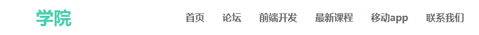

自适应的效果：

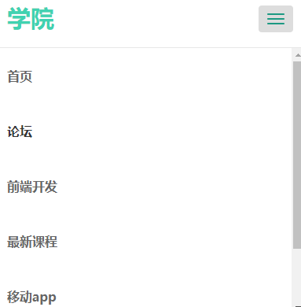

### 3 第一屏的实现

还是在原来的index.html以及css文件中进行书写内容

```html
  <!--3 第一屏的制作-->
  <!--home-->
  <!--快捷键：section#home + tab-->
  <section id="home">
    <!--快捷键：div.filter + tab-->
    <div class="filter">
      <div class="container">
        <!--字体显示，将其分为12栏，其中中间占10栏，让字体在中间10栏，这样左右两边就会留出1栏的宽度-->
        <div class="row">
          <div class="col-md-1"></div>
          <div class="col-md-10">
            <h1>bootstrap实战等你来战</h1>
            <p>
                本套课程适用于：1WEB开发人员；2网站维护人员、管理人员 <br/>
                培训技能的目标：使用bootstrap框架快速构件响应式网页。
            </p>
            <!--img-responsive样式是为了让图片自适应-->
            
          </div>
          <div class="col-md-1"></div>
        </div>
      </div>
    </div>
  </section>
  <!--home-->
  <!--3 第一屏的制作-->
```

```css
/*3 第一屏的实现*/
/*home*/
#home {
  /*根据导航栏的高度来设定的*/
  margin-top: 70px;
  background: url("../images/home-bg.jpg");
  background-size: cover;
  color: #ffffff;
  text-align: center;
  width: 100%;
  /*去掉*/
  /*height: 500px;*/
}

.filter{
  width: 100%;
  height: 100%;
  background: rgba(0,0,0,0.7);
  /*内部元素距离上下边距90px，左右为0*/
  padding: 90px 0;
}

#home h1{
  font-weight: bold;
  /*去掉h1中的固定样式*/
  margin-top: 0;
  /*让其跟下面的文字相距25个像素*/
  margin-bottom: 25px;
}

#home p{
  font-weight: 400;
  line-height: 35px;
}

#home img{
  margin-top: 30px;
  display: inline-block;
}
/*3 第一屏的实现*/
```

实现的效果如下：


自适应的效果：


### 4 第二屏bbs论坛制作

继续在下面编写：这里记住一个分割的场景是12栏，有固定结构。

```html
  <!--4 第二屏bbs的制作-->
  <section id="bbs">
    <!--这个是Bootstrap进行分割的常用规格，container表示容器，row表示列分割，一共12栏,可以自定义进行分割-->
    <div class="container">
      <div class="row">
        <div class="col-md-4">
          <a href="http://www.baidu.com" target="_blank">
            <!--class="img-responsive"的作用就是自适应缩放图标-->
            
            <h3>Android开发</h3>
            <p>Android开发技术交流、问题求助、实战案例分享</p>
          </a>
        </div>
        <div class="col-md-4">
          <a href="http://www.baidu.com" target="_blank">
            
            <h3>IOS开发</h3>
            <p>iOS开发技术交流，海量iOS实战干货分享</p>
          </a>
        </div>
        <div class="col-md-4">
          <a href="http://www.baidu.com" target="_blank">
            
            <h3>嵌入式底层开发</h3>
            <p>底层嵌入式开发、实战案例等技术交流讨论</p>
          </a>
        </div>
      </div>
    </div>
  </section>
  <!--4 第二屏bbs的制作-->
```

```css
/*4 第二屏bbs*/
#bbs{
  /*后面这个左右为0，如果添加了可以让分栏被选中的时候让阴影抵达两边，如果不添加就会两边有距离*/
  padding: 80px 0;
  text-align: center;
}
/*给每一个分栏添加外边距*/
#bbs .col-md-4{
  padding: 15px;
}
/*每一个分栏选中的时候添加整体背景变成其他白色，并添加阴影*/
#bbs .col-md-4:hover{
  background: #f1f1f1;
  box-shadow: 1px 1px 4px #cccccc;
}
/*修改a标签的默认颜色*/
#bbs a{
  color:#212121;
  /*去除下划线处理*/
  text-decoration: none;
}
/*设定img标签在中间*/
#bbs img{
  margin: 0 auto;
}
#bbs h3{
  font-weight: bold;
}
/*4 第二屏bbs*/
```

效果如下：

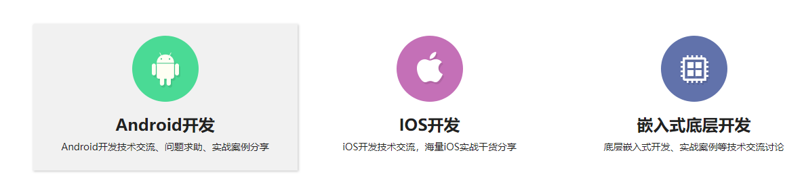

自适应：

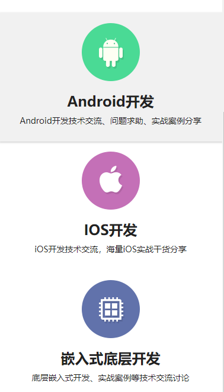

### 5 第三屏html5区域

\<span class="glyphicon glyphicon-grain mai-icon">中的glyphicon glyphicon-grain是网上寻找到的麦子造型图标。

这个图标是Bootstrap官网上的组件：https://v3.bootcss.com/components/。

```html
  <!--5 第三屏html5-->
  <section id="html5">
    <div class="container">
      <div class="row">
        <div class="col-md-6">
          <h2>HTML5前端开发</h2>
          <p>一线资深前端开发工程师倾情打造！助你完成普通程序员到优秀工程师的华丽升级！</p>
          <p><span class="glyphicon glyphicon-grain mai-icon"></span>使用HTML5与CSS3技术轻松实现设备自适应展示。</p>
          <p><span class="glyphicon glyphicon-grain mai-icon"></span>清晰明了的语义代码结构，更高的可读性、更利于页面维护的。</p>
        </div>
        <div class="col-md-6">
          
        </div>
      </div>
    </div>
  </section>
  <!--5 第三屏html5-->
```

```css
/*5 第三屏html5*/
/*放在最前面是为了让其有全局的效果*/
.mai-icon{
  background: rgb(64, 210, 177);
  color: #ffffff;
  /*让外边圆角*/
  border-radius: 50%;
  /*两边同宽*/
  height: 40px;
  width: 40px;
  /*文字居中*/
  text-align: center;
  /*调整文字跟行高相同*/
  line-height: 40px;
  /*让图标跟右边文字有一定距离*/
  margin-right: 20px;
}
/*5 第三屏html5*/

/*5 第三屏html5*/
/* # 表示对于id进行样式*/
/* . 表示对于class进行样式*/
/* 直接写在后面的是标签*/
#html5{
  /*增加背景*/
  background: #f8f8f8;
  padding: 80px 0;
}
#html5 h2{
  font-weight: bold;
}
#html5 p{
  line-height: 40px;
}
/*5 第三屏html5*/
```

展示效果如下：

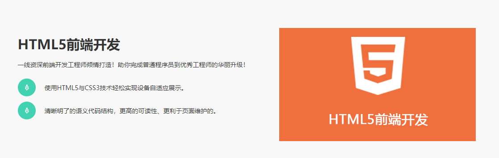

自适应效果：

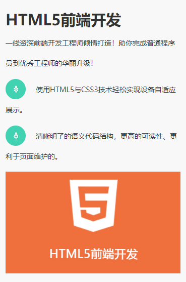

### 6 第四屏Bootstrap

这里设定将html5和Bootstrap都作为前端开发模块，所以导航栏不添加索引。在css上也是基本相同。

```html
  <!--6 第四屏Bootstrap-->
  <!--这里设定html5和Bootstrap都是前端开发，所以在导航栏就不设定索引-->
  <section id="Bootstrap ">
    <div class="container">
      <div class="row">
        <div class="col-md-6">
          
        </div>
        <div class="col-md-6">
          <h2>bootstrap实战视频教程</h2>
          <p>Bootstrap 是最受欢迎的 HTML、CSS 和 JS 框架，用于开发响应式布局、移动设备优先的 WEB 项目。</p>
          <p><span class="glyphicon glyphicon-grain mai-icon"></span>你的网站和应用能在 Bootstrap 的帮助下通过同一份代码快速、有效适配手机、平板、PC 设备。</p>
          <p><span class="glyphicon glyphicon-grain mai-icon"></span>Bootstrap 提供了全面、美观的文档。你能在这里找到关于 HTML 元素、HTML 和 CSS 组件、jQuery 插件方面的所有详细文档。</p>
        </div>
      </div>
    </div>
  </section>
  <!--6 第四屏Bootstrap-->
```

```css
/*5 第三屏html5 6 第四屏Bootstrap*/
/* # 表示对于id进行样式*/
/* . 表示对于class进行样式*/
/* 直接写在后面的是标签*/
#html5{
  /*增加背景*/
  background: #f8f8f8;
}
/*这里同时设定了两个class的样式*/
#html5 , #Bootstrap{
  padding: 80px 0;
}
#html5 h2 , #Bootstrap h2{
  font-weight: bold;
}
#html5 p , #Bootstrap p{
  line-height: 25px;
}
/*5 第三屏html5 6 第四屏Bootstrap*/
```

### 7 第五屏最新课程

这里有意思的一点是在css中添加了一个鼠标悬浮按钮会出现动画渲染颜色的操作。

```html
  <!--7 第五屏course-->
  <section id="course">
    <div class="container">
      <div class="row">
        <div class="col-md-12">
          <h2>最新课程</h2>
        </div>
        <!--这里省略了7个-->
        <div class="col-md-3">
          <div class="course">
            
            <a href="http://baidu.com" class="btn btn-primary" target="_blank" role="button">
              加入学习
            </a>
          </div>
        </div>
      </div>
    </div>
  </section>
  <!--7 第五屏course-->
```

```css
/*7 第五屏course*/
#course{
  background: #f8f8f8;
  padding: 80px 0;
  text-align: center;
}
#course h2{
  font-weight: bold;
  padding-bottom: 60px;
}
#course .col-md-3{
  margin-bottom: 20px;
}
.course {
  background: #ffffff;
}
#course .btn{
  /*背景透明处理*/
  background: transparent;
  border: 1px solid #40D2B1;
  border-radius: 0px;
  color: #40D2B1;
  margin-top: 20px;
  margin-bottom: 30px;
  padding: 8px 40px;
  /*添加过渡效果,鼠标悬浮到按钮上，颜色变化0.5s*/
  transition: all 0.5s;
}
#course .btn:hover{
  background: #40D2B1;
  color: #ffffff;
}
/*7 第五屏course*/
```

动画效果展示：

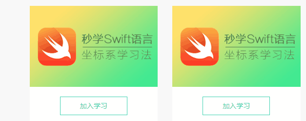

### 8 第六屏app

跟上面的都是类似的，但是这里有一个快捷键，快捷键创建 div.col-md-6*2 + tab可以快速创建两个。

```html
  <!--8 app-->
  <section id="app">
    <div class="container">
      <div class="row">
        <!--快捷键创建 div.col-md-6*2 + tab可以快速创建两个-->
        <div class="col-md-6">
          <h2>麦子学院移动APP下载</h2>
          <p>
            全新UI交互，与新网站数据同步，更加丰富的课程，开启精彩无限，语音搜索课程，喊出你想要的课程，一件收藏，方便自己重复学习，离线下载课程，在哪儿都能开！
          </p>
          <button class="btn btn-primary">
            <span class="glyphicon glyphicon-download-alt"></span>
            iPhone版
          </button>
          <button class="btn btn-primary">
            <span class="glyphicon glyphicon-download-alt"></span>
            Android版
          </button>
        </div>
        <div class="col-md-6">
          
        </div>
      </div>
    </div>
  </section>
  <!--8 app-->
```

```css
/*8 app*/
#app{
  padding: 80px 0;
}
#app h2{
  font-weight: bold;
  padding-bottom: 30px;
}
#app .btn{
  margin: 10px 0;
  background: rgb(64, 210, 177);
  border-color: rgb(64, 210, 177);
  border-radius: 0;
  padding: 6px 30px;
  transition: all 0.5s;
}
#app .btn:hover{
  background: rgb(44, 142, 120);
}
/*8 app*/
```

效果展示：

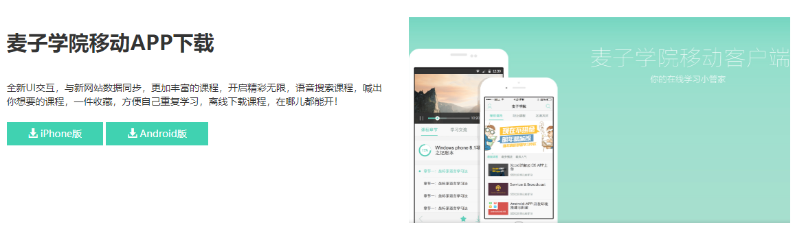

### 9 第七屏content

```html
  <!--9 第七屏contact联系区域-->
  <section id="contact">
    <div class="filter">
      <div class="container">
        <div class="row">
          <div class="col-md-6">
            <h2>
              <span class="glyphicon glyphicon-send"></span>
              &nbsp;
              联系小麦
            </h2>
            <p>麦子学院是成都麦子信息技术有限公司旗下一个IT在线教育平台，目前已有30万注册用户，10万以上APP下载量，5000小时视频内容。 我们从不说空话，专注于IT在线教育，脱离传统教育的束缚，让你走哪学哪，想学就学。逗比的老师，贴心的助教，在这儿你能感受到来自五 湖四海伙伴们热情和踏实的学习态度！</p>
            <!--使用address标签，让其语义更好-->
            <address>
              <p>
                <span class="glyphicon glyphicon-home"></span>
                &nbsp;
                地址:成都市高新区天府软件园D5-11
              </p>
              <p>
                <span class="glyphicon glyphicon-phone-alt"></span>
                &nbsp;
                联系电话：028-86567913
              </p>
              <p>
                <span class="glyphicon glyphicon-envelope"></span>
                &nbsp;
                邮箱:hr@maiziedu.com
              </p>
            </address>
          </div>
          <div class="col-md-6">
            <form action="#" method="post">
              <div class="col-md-6">
                <input type="text" class="form-control" placeholder="您的姓名"/>
              </div>
              <div class="col-md-6">
                <input type="email" class="form-control" placeholder="您的邮箱"/>
              </div>
              <div class="col-md-12">
                <input type="text" class="form-control" placeholder="标题"/>
              </div>
              <div class="col-md-12">
                <!--这里的textarea标签之间不能有空格，否则留言内容显示不出来。row设定行数-->
                <textarea class="form-control" placeholder="留言内容" rows="4"></textarea>
              </div>
              <div class="col-md-8">
                <input type="submit" class="form-control" value="提交"/>
              </div>
            </form>
          </div>
        </div>
      </div>
    </div>
  </section>
  <!--9 第七屏contact联系区域-->
```

```css
/*9 contact*/
#contact{
  /*通过url属性获取背景，并让其不重复*/
  background: url("../images/contact-bg.png") no-repeat;
  /*全覆盖属性*/
  background-size: cover;
  color: #ffffff;
  /*这个是测试使用，自适应会因为这个出现问题，去掉*/
  /*height: 500px;*/
}
#contact h2{
  font-weight: bold;
  margin-top: 0;
  margin-bottom: 25px;
}
#contact p{
  line-height: 25px;
  margin-bottom: 20px;
}
#contact .form-control {
  border: none;
  /*这个的作用是将Bootstrap默认的圆角给取消*/
  border-radius: 0;
  height: 50px;
  margin-bottom: 20px;
}
/*因为前面设定了height: 50px，在这里textarea标签会收到影响。因此重新定义高度为auto，这样会根据row属性进行调节*/
#contact textarea.form-control{
  height: auto;
}
/*通过该方式获取到input中特定的submit类型，特定设置*/
#contact input[type="submit"]{
  background: #40D2B1;
  color: #fff;
  font-weight: bold;
  transition: all 0.3s;
}
/*配合上面的transition进行颜色渐变的动画*/
#contact input[type="submit"]:hover{
  background: rgb(44, 142, 120);
}
/*9 contact*/
```

这样如果是全屏看是没有问题的，但是一旦自适应之后就会出现下面的错误。修改很简单，将上面测试使用的500px去掉就好了。

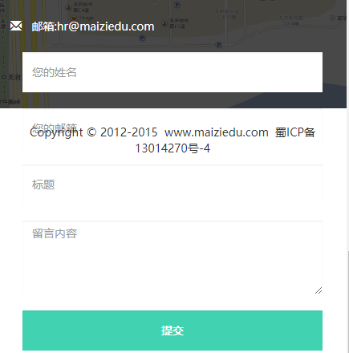

### 10 第八屏footer

```html
  <!--10 footer-->
  <footer>
    <div class="container">
      <div class="row">
        <div class="col-md-12">
          <p>
            Copyright&nbsp;©&nbsp;2012-2015&nbsp;&nbsp;www.maiziedu.com&nbsp;&nbsp;蜀ICP备13014270号-4
          </p>
        </div>
      </div>
    </div>
  </footer>
  <!--10 footer-->
```

```css
/*10 footer*/
footer{
  font-weight: 400;
  text-align: center;
  padding:20px ;
}
```

### 11 添加加载动画效果

这里需要使用插件，所谓插件就是js、css文件。

添加的位置不同，一般将script添加到最后：

```html
  <!--导航栏动画-->
  <script src="./js/jquery.singlePageNav.min.js"></script>
  <!--页面动画-->
  <script src="js/wow.min.js"></script>
```

将样式css添加到head标签中：

```html
  <!--用于配合wow显示加载动画-->
  <link rel="stylesheet" href="css/animate.css" />
```

#### 针对导航栏

使用jquery.singlePageNav.min.js，直接在添加的script之后添加script函数。

```html
 <script>
    $(function () {
      // 导航跳转效果
      // 选择导航栏对应的标签nav，使用singlePageNav进行创建。
      // 属性offset是对于导航栏宽度70的偏移，这样可以防止导航栏遮盖页面
      $('.nav').singlePageNav({
        offset: 70
      });
      // 小屏幕情况下，导航栏点击之后，会自动关闭菜单。添加了一个click事件，绑定了向上隐藏的功能。
      $('.navbar-collapse a').click(function () {
        $('.navbar-collapse').collapse('hide');
      });
      // 初始化WOW方法，这样就可以在需要使用的地方使用wow动画，一定要配合animate使用
      new WOW().init();
    })
  </script>
```

效果如下：

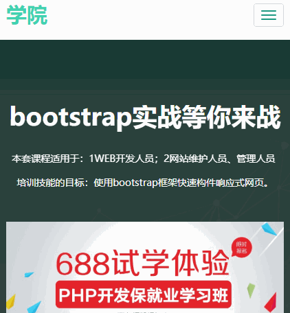

#### 针对页面动画

使用animate.css+wow.min.js，首先先在script中进行初始化：

> new WOW().inti();

然后有如下几个可用属性：

- data-wow-duration（动画持续时间）：data-wow-duration="2s"
- data-wow-delay（动画延迟时间）：data-wow-delay="5s"
- data-wow-offset（偏移量）：data-wow-offset="10"距离可视区域多远开始执行动画
- data-wow-iteration（重复次数）：data-wow-iteration="10"

接下来需要从animate的网址中获取相应的动画样式：http://daneden.github.io/animate.css/在这里可以看到它所支持的样式。

最后只需要在需要使用动画的模块中添加对应的样式就好了。比如：

```html
<div class="container">
        <div class="row wow fadeInUp" data-wow-duration="1s" data-wow-delay="1s">
```

让home这个section中的内容div添加样式。向上的延迟1s并持续1s的动画。效果如下：


## demo2 后台管理页面

### 1 主页面

这里创建了四个页面，包括：index.html、content.html、user_list.html、tag.html，其中的导航栏和底部都是一样的，这直接复制粘贴就好了。

```html
<!--2 导航栏的制作-->
<!DOCTYPE html>
<html lang="zh-CH">

<head>
  <meta charset="UTF-8">
  <meta http-equiv="x-ua-compatible" content="IE=edge">
  <meta name="viewport" content="width=device-width, initial-scale=1, user-scalable=no">
  <title>bootstrap实战</title>
  <link rel="stylesheet" href="css/bootstrap.min.css"/>
  <!--自定义了一个css文件，用于覆盖Bootstrap中的样式-->
  <link rel="stylesheet" href="css/bootstrap-index.css"/>
</head>

<body>
  <!--导航-->
  <nav class="navbar navbar-default navbar-fixed-top">
    <div class="container">
      <!--小屏幕导航按钮和logo-->
      <div class="navbar-header">
        <button class="navbar-toggle" data-toggle="collapse" data-target=".navbar-collapse">
          <!--incon-bar有几个就会有个按钮线-->
          <span class="icon-bar"></span>
          <span class="icon-bar"></span>
          <span class="icon-bar"></span>
        </button>
        <!--logo的设置-->
        <a href="index.html" class="navbar-brand">Maizi Admin</a>
      </div>
      <!--小屏幕导航按钮和logo-->

      <!--右边导航-->
      <div class="navbar-collapse collapse">
        <ul class="nav navbar-nav">
          <!--li 中的active样式表示被选中效果-->
          <li class="active"><a href="index.html"><span class="glyphicon glyphicon-home"></span>&nbsp;&nbsp;后台首页</a></li>
          <li><a href="user_list.html"><span class="glyphicon glyphicon-user"></span>&nbsp;&nbsp;用户管理</a></li>
          <li><a href="content.html"><span class="glyphicon glyphicon-list-alt"></span>&nbsp;&nbsp;内容管理</a></li>
          <li><a href="tag.html"><span class="glyphicon glyphicon-tags"></span>&nbsp;&nbsp;标签管理</a></li>
        </ul>
        <ul class="nav navbar-nav navbar-right">
          <!--这个可以直接从Bootstrap官网中获取下拉菜单插件。但是需要修改样式。-->
          <li class="dropdown">
            <a id="dLabel" type="button" data-toggle="dropdown" aria-haspopup="true" aria-expanded="false">
              admin
              <span class="caret"></span>
            </a>
            <ul class="dropdown-menu" aria-labelledby="dLabel">
              <li><a href="index.html"><span class="glyphicon glyphicon-screenshot"></span>&nbsp;&nbsp;前台首页</a></li>
              <li><a href="index.html"><span class="glyphicon glyphicon-user"></span>&nbsp;&nbsp;个人主页</a></li>
              <li><a href="index.html"><span class="glyphicon glyphicon-cog"></span>&nbsp;&nbsp;个人设置</a></li>
              <li><a href="index.html"><span class="glyphicon glyphicon-credit-card"></span>&nbsp;&nbsp;账户中心</a></li>
              <li><a href="index.html"><span class="glyphicon glyphicon-heart"></span>&nbsp;&nbsp;我的收藏</a></li>
            </ul>
          </li>
          <li><a href="#bbs"><span class="glyphicon glyphicon-off"></span>&nbsp;&nbsp;退出</a></li>
        </ul>
      </div>
      <!--右边导航-->
    </div>
  </nav>
  <!--导航-->

  <!-- footer-->
  <footer>
    <div class="container">
      <div class="row">
        <div class="col-md-12">
          <p>
            Copyright&nbsp;©&nbsp;2012-2015&nbsp;&nbsp;www.maiziedu.com&nbsp;&nbsp;蜀ICP备13014270号-4
          </p>
        </div>
      </div>
    </div>
  </footer>
  <!-- footer-->

  <!--注意，jQuery一定要在Bootstrap之前，这是因为Bootstrap使用了jQuery-->
  <script src="js/jquery.min.js"></script>
  <script src="js/bootstrap.min.js"></script>

</body>
</html>
```

```css
/*样式的调整可以通过F12进行样式选择，然后找到对应的选择器或者标签进行实时修改。*/
body{
  font-family: 'Microsoft YaHei', sans-serif;
}

/* footer*/
footer{
  font-weight: 400;
  text-align: center;
  padding:20px ;
}
```

显示效果如下：

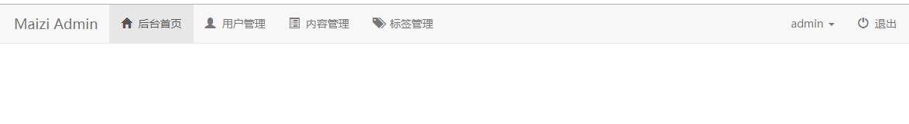

其中下拉菜单是从Bootstrap官网中找到的代码，拿过来进行修改就可以了。然后后台首页使用的阴影效果是添加了class="active"类。每一个不同的页面需要修改。

### 2 后台页面的统计和热帖制作

```html
  <!--警告框 + 数据统计 + 网站热帖-->
  <div class="container">
    <div class="row">
      <div class="col-md-12">
        <!--警告框代码，从Bootstrap网站中获取-->
        <div class="alert alert-danger alert-dismissible fade in" role="alert">
          <button type="button" class="close" data-dismiss="alert" aria-label="Close"><span aria-hidden="true">×</span></button>
          <h4>网站程序有漏洞，急需修复！</h4>
          <p>当前版本程序(V1.22)存在严重安全问题，容易造成攻击，请即可修复！</p>
          <p>
            <button type="button" class="btn btn-danger">立即修复</button>
            <!--data-dismiss="alert"属性是点击之后会消失-->
            <button type="button" class="btn btn-default"  data-dismiss="alert">稍后处理</button>
          </p>
        </div>
        <!--警告框代码，从Bootstrap网站中获取-->
        <!--网站数据统计-->
        <div class="col-md-6">
          <!--表格面板-->
          <div class="panel panel-default">
            <div class="panel-heading">网站数据统计</div>
            <div class="panel-body">
              <!--表格样式-->
              <table class="table table-hover">
                <thead>
                <tr>
                  <th>统计项目</th>
                  <th>今日</th>
                  <th>昨日</th>
                </tr>
                </thead>
                <tbody>
                <tr>
                  <th scope="row">注册会员</th>
                  <td>200</td>
                  <td>400</td>
                </tr>
                <!--...-->
                </tbody>
              </table>
            </div>
          </div>
        </div>
        <!--网站数据统计-->
        <!--网站热帖-->
        <div class="col-md-6">
          <div class="panel panel-default">
            <div class="panel-heading">网站热帖</div>
            <!--<div class="panel-body"> 这是面板的内容，这里去除之后就可以让下文的ul没有外边距-->
            <ul class="list-group">
              <li class="list-group-item">
                <!--这里使用了一个small，这样会让字体更小，谈价pull-right让其右浮动-->
                <a href="index.html"><span class="glyphicon glyphicon-list-alt"></span>&nbsp;&nbsp;泛Mooc职业教育， 效果和就业为王<small class="pull-right">2015/08/08</small></a>
              </li>
                <!--...-->
            </ul>
          </div>
        </div>
        <!--网站热帖-->
      </div>
    </div>
  </div>
  <!--警告框 + 数据统计 + 网站热帖-->
```

```css
body{
  font-family: 'Microsoft YaHei', sans-serif;
  /*padding-top是为了让导航栏浮动并且距离警告框50px，因为导航栏的高度是50px*/
  padding-top: 50px;
}
```

显示效果：

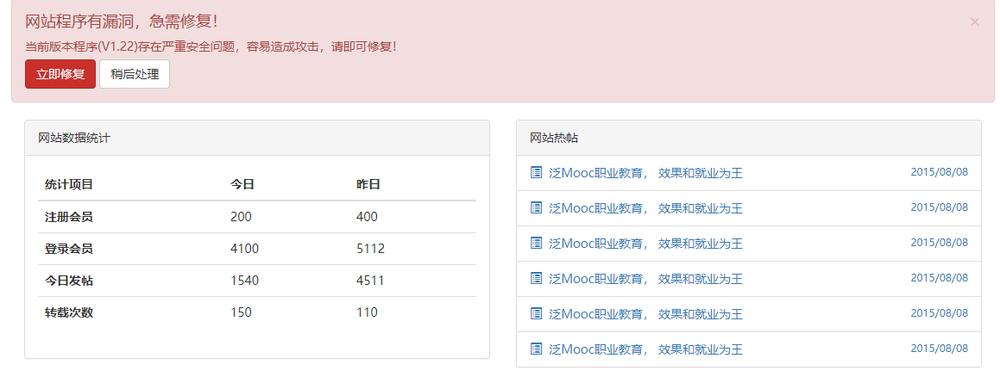

### 3 访客统计图表及进度条统计

插件获取从https://www.chartjs.org/中获取，导入其中的.js文件即可。

```html
  <!--导入作为制作图表-->
  <script src="js/Chart.js"></script>
  <!--导入加载的script.js文件用于曲线图显示-->
  <script src="js/script.js"></script>
```

在需要插入的地方使用canvas固定代码就好了。

```html
        <!--访客统计图表-->
        <div class="col-md-6">
          <div class="panel panel-default">
            <div class="panel-heading">今日访客统计</div>
            <div class="panel-body">
              <!--使用canvas id="canvas"创建图表-->
              <canvas id="canvas" class="col-md-12"></canvas>
            </div>
          </div>
        </div>
        <!--访客统计图表-->
```

查看曲线图表中的js文件：

```js
var lineChartData = {
  //X坐标数据
  labels : ["2","4","6","8","10","12","14","16","18","20","22","24"],
  datasets : [
    {
      //统计表的背景颜色
      fillColor : "rgba(255,255,255,0)",
      //统计表画笔颜色
      strokeColor : "rgba(0, 0,0, 1)",
      //点的颜色
      pointColor : "rgba(155, 39, 39, 1);",
      //点边框的颜色
      pointStrokeColor : "#fff",
      //鼠标触发时点的颜色
      pointHighlightFill : "#fff",
      //鼠标触发时点边框的颜色
      pointHighlightStroke : "rgba(220,220,220,1)",
      //Y坐标数据
      data : [1,2,3,4,5,5,6,7,8,8,9,9]
    },
    {
      fillColor : "rgba(255,255,255,0)",
      strokeColor : "rgba(92, 184, 92, 1)",
      pointColor : "rgba(23, 126, 23, 1)",
      pointStrokeColor : "#fff",
      pointHighlightFill : "#fff",
      pointHighlightStroke : "rgba(151,187,205,1)",
      data : [2,2,1,4,2,4,5,7,8,8,4,3]
    }
  ]

}

window.onload = function(){
  var ctx = document.getElementById("canvas").getContext("2d");
  window.myLine = new Chart(ctx).Line(lineChartData, {
    responsive: true
  });
}
```

显示效果如下：

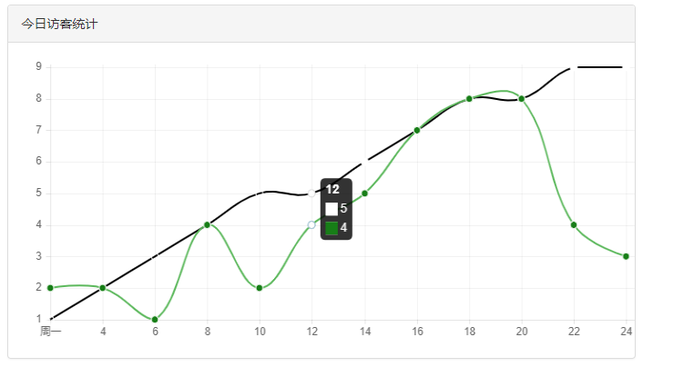

```html
        <!--访客统计图表-->
        <div class="col-md-6">
          <div class="panel panel-default">
            <div class="panel-heading">服务器状态</div>
            <div class="panel-body">
              <p>内存使用率：40%</p>
              <div class="progress">
                <div class="progress-bar progress-bar-success progress-bar-striped" role="progressbar" aria-valuenow="40" aria-valuemin="0" aria-valuemax="100" style="width: 40%"></div>
              </div>
              <p>数据库使用率：20%</p>
              <div class="progress">
                <div class="progress-bar progress-bar-info progress-bar-striped" role="progressbar" aria-valuenow="20" aria-valuemin="0" aria-valuemax="100" style="width: 20%"></div>
              </div>
              <p>磁盘使用率：60%</p>
              <div class="progress">
                <div class="progress-bar progress-bar-warning progress-bar-striped" role="progressbar" aria-valuenow="60" aria-valuemin="0" aria-valuemax="100" style="width: 60%"></div>
              </div>
              <p>CPU使用率：80%</p>
              <div class="progress">
                <div class="progress-bar progress-bar-danger progress-bar-striped" role="progressbar" aria-valuenow="80" aria-valuemin="0" aria-valuemax="100" style="width: 80%"></div>
              </div>
            </div>
          </div>
        </div>
        <!--访客统计图表-->
```

稍微修改一下样式：

```css
/*进度条*/
.progress {
  margin-bottom: 15px;
}
```

效果如下：

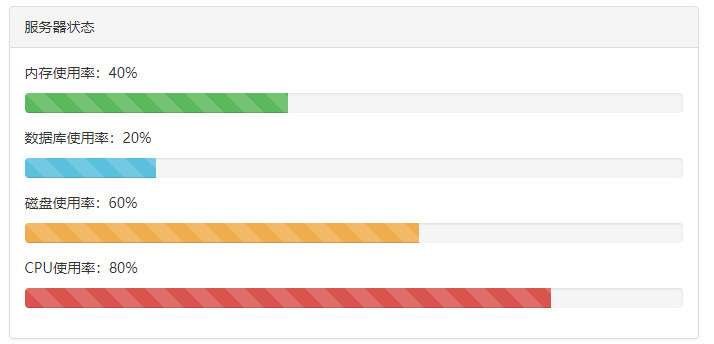

### 4 留言板

```html
<!--留言板-->
        <div class="col-md-12">
          <div class="panel panel-default">
            <div class="panel-heading">团队留言板</div>
            <div class="panel-body">
              <div class="col-md-7">
                <div class="media well">
                  <div class="media-left">
                    <a href="#">
                      
                    </a>
                  </div>
                  <div class="media-body">
                    <h4 class="media-heading">卓大哥</h4>
                    技术大哥，今晚请把网站程序升级一下哈，现在的系统有漏洞，安全起见！
                  </div>
                </div>
                <div class="media well">
                  <div class="media-body text-right">
                    <h4 class="media-heading">技术大哥</h4>
                    收到，今晚凌晨2点准时升级！
                  </div>
                  <div class="media-right">
                    <a href="#">
                      
                    </a>
                  </div>
                </div>
                <div class="media well">
                  <div class="media-body text-right">
                    <h4 class="media-heading">技术大哥</h4>
                    你先在站点发布一下通知哈！
                  </div>
                  <div class="media-right">
                    <a href="#">
                      
                    </a>
                  </div>
                </div>
                <div class="media well">
                  <div class="media-left">
                    <a href="#">
                      
                    </a>
                  </div>
                  <div class="media-body">
                    <h4 class="media-heading">卓大哥</h4>
                    好嘞。
                  </div>
                </div>
              </div>
              <div class="col-md-5">
                <form action="#">
                  <div class="form-group">
                    <label for="text1">输入留言内容</label>
                    <textarea class="form-control" id="text1" rows="5" cols="10" placeholder="请输入留言内容"></textarea>
                    <button type="submit" class="btn btn-default mar_t15">留言</button>
                  </div>
                </form>
                <div class="panel panel-default">
                  <div class="panel-heading">团队联系手册</div>
                  <div class="panel-body">
                    <ul class="list-group">
                      <li class="list-group-item">站长(李小龙)：<span class="glyphicon glyphicon-phone"></span>&nbsp;&nbsp;13134848615</li>
                      <li class="list-group-item">技术(大牛哥)：<span class="glyphicon glyphicon-phone"></span>&nbsp;&nbsp;13456127694</li>
                      <li class="list-group-item">推广(张二哥)：<span class="glyphicon glyphicon-phone"></span>&nbsp;&nbsp;13457815482</li>
                      <li class="list-group-item">客服(王女士)：<span class="glyphicon glyphicon-phone"></span>&nbsp;&nbsp;13134567782&nbsp;&nbsp;<span class="glyphicon glyphicon-phone-alt"></span>&nbsp;&nbsp;028-888888</li>
                    </ul>
                  </div>
                </div>
              </div>
            </div>
          </div>
        </div>
        <!--留言板-->
```

```css
/*留言板表情*/
.wh64{
  width: 64px;
  height: 64px;
  border-radius:50% ;
}
/*留言板留言按钮*/
.mar_t15{
  margin-top: 15px;
}
```

展示效果如下：

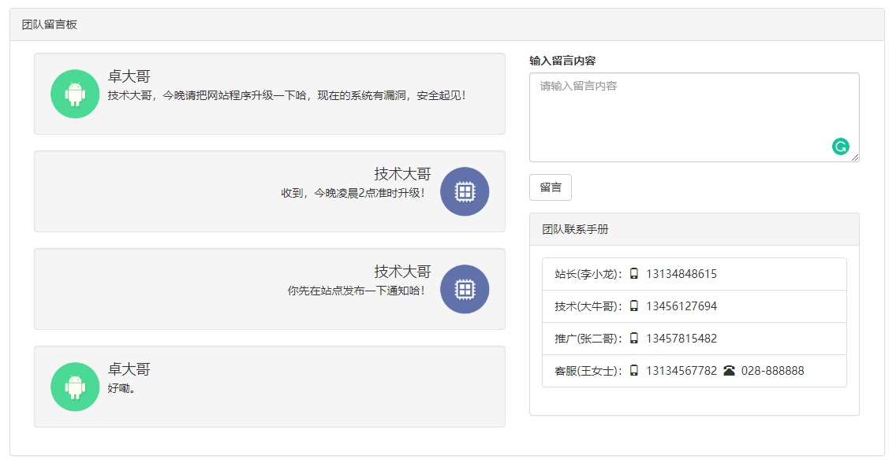

### 5 用户管理

#### 用户列表

在user_list.html中编写用户列表代码：

```html
  <!--用户列表-->
  <div class="container">
    <div class="row">
      <div class="col-md-2">
        <div class="list-group">
          <a href="user_list.html" class="list-group-item active">用户管理</a>
          <a href="user_list.html" class="list-group-item">用户搜索</a>
          <a href="user_list.html" class="list-group-item">添加用户</a>
        </div>
      </div>
      <div class="col-md-10">
        <div class="page-header">
          <h1>用户管理</h1>
        </div>
        <!--表格tabs-->
        <ul class="nav nav-tabs">
          <li class="active">
            <a href="user_list.html">用户列表</a>
          </li>
        </ul>
        <!--表格-->
        <table class="table">
          <!--表头-->
          <thead>
            <tr>
              <th>ID</th>
              <th>用户名</th>
              <th>邮箱</th>
              <th>操作</th>
            </tr>
          </thead>
          <!--表内容-->
          <tbody>
            <tr>
              <!--scope="row" 规定是行表头-->
              <th scope="row">1</th>
              <td>zhangsan</td>
              <td>1234@qq.com</td>
              <td>
                <div role="presentation" class="dropdown">
                  <!--将原来的li修改为button，添加button的样式btn btn-default-->
                  <button class="btn btn-default dropdown-toggle" data-toggle="dropdown" href="#" role="button" aria-haspopup="true" aria-expanded="false">
                    操作<span class="caret"></span>
                  </button>
                  <ul class="dropdown-menu">
                    <li><a href="#">编辑</a></li>
                    <li><a href="#">删除</a></li>
                    <li><a href="#">锁定</a></li>
                    <li><a href="#">修改密码</a></li>
                  </ul>
                </div>
              </td>
            </tr>
          </tbody>
        </table>
        <nav class="pull-right">
          <ul class="pagination">
            <li class="disabled"><a href="#" aria-label="Previous"><span aria-hidden="true">&laquo;</span></a></li>
            <li class="active"><a href="#">1</a></li>
            <li><a href="#">2 </a></li>
            <li><a href="#">3 </a></li>
            <li><a href="#">4 </a></li>
            <li><a href="#">5 </a></li>
            <li><a href="#">6 </a></li>
            <li><a href="#"><span aria-hidden="true">&raquo;</span></a></li>
          </ul>
        </nav>
      </div>
    </div>
  </div>
  <!--用户列表-->
```

```css
/*用户管理字体*/
.page-header{
  margin-top: 0;
}
.page-header h1{
  margin: 0;
  font-size: 16px;
  font-weight: bold;
}
```

效果如下：

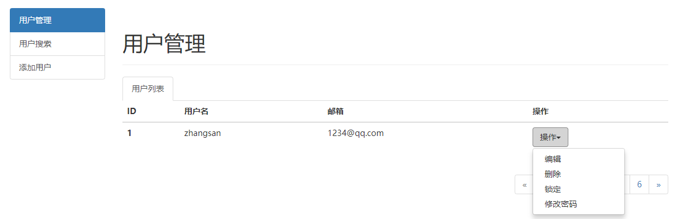

#### 用户搜索

创建一个新的页面：user_search.html。

```html
<!--用户列表-->
  <div class="container">
    <div class="row">
      <div class="col-md-2">
        <div class="list-group">
          <a href="user_list.html" class="list-group-item">用户管理</a>
          <a href="user_search.html" class="list-group-item active">用户搜索</a>
          <a href="user_list.html" class="list-group-item">添加用户</a>
        </div>
      </div>
      <div class="col-md-10">
        <div class="page-header">
          <h1>用户管理</h1>
        </div>
        <!--表格tabs-->
        <ul class="nav nav-tabs">
          <li class="active">
            <a href="user_search.html">用户搜索</a>
          </li>
        </ul>
        <form action="#" class="user_search">
          <div class="alert alert-info" role="alert">
            <strong>技巧提示：支持模糊搜索和匹配搜索</strong>
          </div>
          <div class="form-group">
            <label for="name">用户名</label>
            <input type="text" id="name"class="form-control" placeholder="请输入用户名">
          </div>
          <div class="form-group">
            <label for="uid">UID</label>
            <input type="text" id="uid"class="form-control" placeholder="请输入UID">
          </div>
          <div class="form-group">
            <label for="usergroup">UID</label>
            <select id="usergroup" class="form-control">
              <option>限制会员</option>
              <option>普通会员</option>
              <option>高级会员</option>
            </select>
          </div>
          <button type="submit" class="btn btn-default">提交</button>
        </form>
      </div>
    </div>
  </div>
  <!--用户列表-->
```

```css
/*用户搜索*/
.user_search{
  padding: 10px;
  border: solid 1px #ddd;
  border-top: none;
}
```

效果如下：

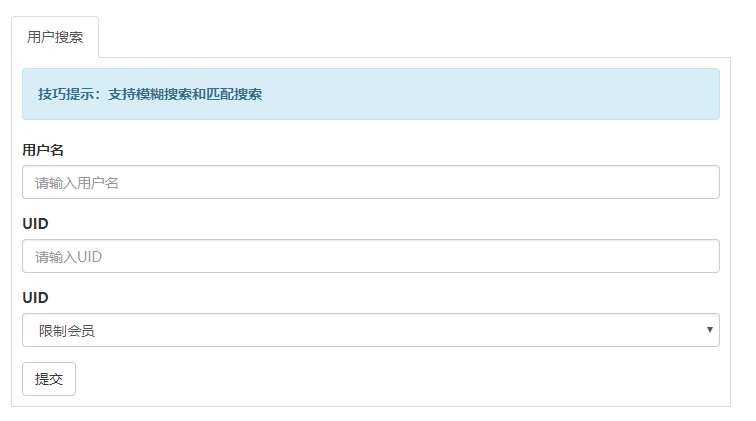

#### 添加用户

修改添加用户：

```html
<a href="" role="button"  class="list-group-item" data-toggle="modal" data-target="#myModal">添加用户</a>
```

```html
  <!--添加用户-->
  <div class="modal fade" id="myModal" tabindex="-1" role="dialog" aria-labelledby="myModalLabel">
    <div class="modal-dialog" role="document">
      <div class="modal-content">
        <div class="modal-header">
          <button type="button" class="close" data-dismiss="modal" aria-label="Close"><span aria-hidden="true">&times;</span></button>
          <h4 class="modal-title" id="myModalLabel">添加用户</h4>
        </div>
        <div class="modal-body">
          <form action="#">
            <div class="form-group">
              <label for="addname">用户名</label>
              <input type="text" id="addname" class="form-control" placeholder="用户名">
            </div>
            <div class="form-group">
              <label for="addpassword">用户密码</label>
              <input type="text" id="addpassword" class="form-control" placeholder="请输入用户密码">
            </div>
            <div class="form-group">
              <label for="addpassword1">确认用户密码</label>
              <input type="text" id="addpassword1" class="form-control" placeholder="请确认输入用户密码">
            </div>
            <div class="form-group">
              <label for="addemail">请输入用户邮箱</label>
              <input type="email" id="addemail" class="form-control" placeholder="请输入用户邮箱">
            </div>
            <div class="form-group">
              <label for="addyonghuzu">所属用户组</label>
              <select id="addyonghuzu" class="form-control">
                <option>限制会员</option>
                <option>新手上路</option>
                <option>组册会员</option>
                <option>中级会员</option>
                <option>高级会员</option>
              </select>
            </div>
          </form>
        </div>
        <div class="modal-footer">
          <button type="button" class="btn btn-default" data-dismiss="modal">关闭</button>
          <button type="button" class="btn btn-primary">提交</button>
        </div>
      </div>
    </div>
  </div>
  <!--添加用户-->
```

效果如下：

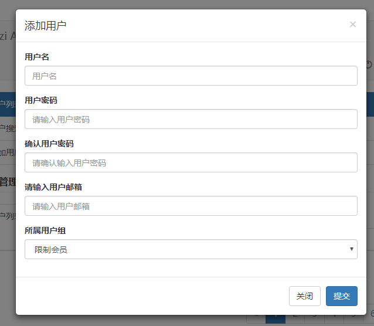

