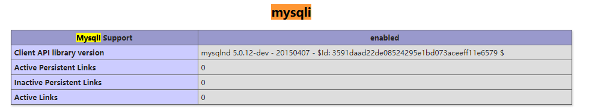
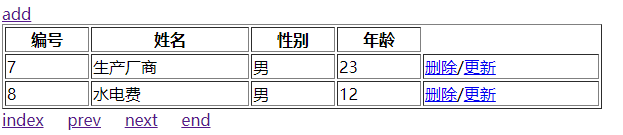
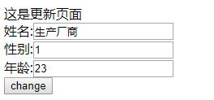

# PHP

> zzc
>
> 参考地址：[PHP中文网-PHP语法基础与数据库详解教程](http://www.php.cn/code/29825.html)

## 3.21 基础知识

输出：`echo print`

调试：`var_dump()`

变量：`$var = 'num';`	//弱类型语言

数组：`$num = array('111', 'sdf');`

对象：`$obj = new Person()`;	需要先创建一个Person类

运算符：`-x` 取反；`'hehe'.'nihao' -> 'hehenihao'` 并置，连接字符串

i`f elseif else`：**elseif**中间没有空格

相等判断：`==`：表示值是否相等。`===`：全等于，类型也要相等

foreach循环：遍历数组使用

```php
<?php
$girl = array('lili', 'jily', 'timmy');

foreach ($girl as $key => $value)
{
    echo $key.':'.$value.'<br>';
}
?>
```

函数：`function func_name()`

日期函数：`date('Y-m-d H:i:s')`

## 3.22 基础知识

### 数组

1. 数值数组：`$cars = array("volvo", "BMW", "Toyota");`
2. 关联数组：`$age = array("Peter"=>"35", "Joe"=>"43");`
3. 二维数组：`$cars = array( array("volvo", 100, 96), array("BMW", 60, 59) );`
4. 或者不需要array：`$cars = ["volvo", "BMW"];`

可以使用count()函数计算数组中的个数。

### 字符串函数：

1. explode()：把字符串打散为数组
2. implode() == join()：将数组元素合成为数组
3. trim()：去掉字符串两边的字符
4. md5()：计算字符串的MD5散列
5. str_replace()：替换字符串中的一些字符（大小写敏感）

### 数组函数：

1. array_keys()：返回数组中所以的键名
2. array_pop()：删除数组中的最后一个元素（出栈）
3. array_push()：将一个或多个元素插入数组的末尾（入栈）
4. array_rand()：从数组中随机选出一个或多个元素，返回键名
5. array_shift()：删除数组中的第一个元素，并返回被删除的元素
6. count()：返回数组中元素的数目
7. in_array()：检查数组中是否存在指定的值

## 4.10 
### 图片获取

其中enctype = "multipart/form-data"不能少

```php+HTML
<html>
    <head>
        <meta charset = "utf8" />
        <title>登录</title>
    </head>
    
    <body>
        <form name = "login" action = "index.php" method = "POST" enctype = "multipart/form-data">
            <input type = "text" name = "username" placeholder = "请输入用户名"/>
            <input type = "password" name = "password" placeholder = "请输入密码" />
            <!-- 单选 -->
            <input type = "radio" name = "sex" value = "1">男
            <input type = "radio" name = "sex" value = "0">女
            <!-- 文件上传 -->
            <input type = "file" name = "img" />
            <input type = "submit" name = "sub" value = "开始登陆" />
        </form>
    </body>
</html>
```

### 获取form表单+文件上传：

```php+HTML
<html>
    <head>
        <meta charset = "utf8" />
        <title>登录</title>
    </head>
    
    <body>
        <form name = "login" action = "index.php" method = "POST">
            <input type = "text" name = "username" placeholder = "请输入用户名"/>
            <input type = "password" name = "password" placeholder = "请输入密码" />
            <!-- 单选 -->
            <input type = "radio" name = "sex" value = 1>男
            <input type = "radio" name = "sex" value = 0>女
            <!-- 文件上传 -->
            <input type = "file" name = "img" />
            <input type = "submit" name = "sub" value = "开始登陆" />
        </form>
    </body>
</html>

// index.php
<?php
    var_dump($_GET);		//接收get方法
    var_dump($_POST);		//接收post方法
    var_dump($_REQUEST);	//两者都可以接收
?>
```

## 4.13 

### 可以获取网络上面的文件


```PHP
<?php
// 写入
file_put_contents('log.txt', '首次加入');
// 追加的方式加入
file_put_contents('log.txt', '二次加入', FILE_APPEND);
// 获取
var_dump(file_get_contents('log.txt'));
// 获取百度网页
$html = file_get_contents('http://www.baidu.com');

file_put_contents('baidu.html', $html);
?>
```

### 文件读取流程
创建、打开、关闭、获取、目录、判断文件、判断目录
```php
<?php
// 创建文件
touch('file.txt');

// 打开文件
$handle = fopen('file.txt', 'w');

// 写入文件
fwrite($handle, 'hello'."\n");
fwrite($handle, ' world'."\n");
fwrite($handle, ' children');

fclose($handle);

// 读取文件
$file = fopen('file.txt', 'r');

// 循环获取
while(!feof($file))
{
    echo fgets($file).'<br>';
}

fclose($file);

// 判断目录
if(!is_dir('ok'))
{
    // 创建目录
    mkdir('ok', 0777);
    chmod('ok', 0777);
}

// 判断文件
var_dump(is_file('file.txt'));

?>
```

### gd2图片处理库的使用

```php
<?php
// 生成图片文件
$file = imagecreate(100, 50);   

// 图片颜色分配
$bg = imagecolorallocate($file, 0, 180, 255);
$color = imagecolorallocate($file, 255, 255, 255);

// 图片填充
imagefill($file, 0, 0, $bg);

// 写入图片字符
imagechar($file, 5, 10, 25, 'p', $color);
imagechar($file, 5, 30, 25, 'h', $color);
imagechar($file, 5, 50, 25, 'p', $color);

// 告知浏览器使用图片中的png格式输出
header("Content-Type:image/png");

// 按照png的格式输出
imagepng($file);
?>
```

### 正则表达式

```php
<?php
$str = 'abce';

// 有字母同时要有数字
// 正则表达模式如下：//；中间写入内容
$pattern = '/\d\w/';

$result = preg_match($pattern, $str);

var_dump($result);
?>
```

## 4.15

### 用户注册，进行表单验证

这里使用正则表达式失败，需要重新设计正则匹配

```php+HTML
<?php

$patternUserName = '/[0-9a-zA-Z_](3,18)/';

if (!preg_match($patternUserName, $_POST['username']))
{
    exit('用户名不合法');
}

if (!preg_match('/^[0-9a-zA-Z._]+@[0-9a-zA-Z.]+$/', $_POST['email']))
{
    exit('邮箱不合法');
}

if (!preg_match('/^1[0-9](10)$/', $_POST['phone']))
{
    exit('手机号不合法');
}

if (!preg_match('/^[0-9a-zA-Z._](6,18)$/', $_POST['password']))
{
    exit('密码不合法');
}

if ($_POST['password'] != $_POST['re-password'])
{
    exit('确认密码不一致');
}

echo '注册成功';

?>

<html>
    <head>
        <meta charset="utf8" />
        <title>注册用户</title>
    </head>

    <body>
        <h1>用户注册</h1>
        <form action="doRegister.php" method="POST" name="register">
            <input type="text" name="username" placeholder="请输入用户名" />
            <input type="text" name="email" placeholder="请输入邮箱" />
            <input type="text" name="phone" placeholder="请输入手机号" />
            <input type="text" name="password" placeholder="请输入密码" />
            <input type="text" name="re-password" placeholder="请确认密码" />
            <input type="submit" name="sub" value="快速注册"/>
        </form>
    </body>
</html>
```

## 4.16 

### session进行记录保存

```php+HTML
<?php session_start() ?>
<html>
    <head>
        <meta charset="utf8" />
        <title>register</title>
    </head>

    <body>
    <?php if(!$_SESSION['user']){ ?>
        <h1>register</h1>
        <form action="doLogin.php" method="POST" name="register">
            <input type="text" name="username" placeholder="请输入用户名" />
            <input type="password" name="password" placeholder="请输入密码" />
            <input type="submit" name="sub" value="快速登录" /> 
        </form>
    <?php }else{ ?>
        <h1>
            <?php echo $_SESSION['user']['username'].'已经登录'; ?>
        </h1>
    <?php } ?>
    </body>
</html>

<?php

session_start();    //开启session，需要配合cookie进行使用

$_SESSION['user'] = $_POST; //可以存储数组

var_dump($_SESSION);

?>
```

### 数据库

#### 安装phpMyAdmin

安装phpMyAdmin，直接下载在wwwroot（nginx/html/）目录下就好了。记得改名字，比如我的改为phpMyAdmin，访问直接是url/phpMyAdmin就可以了。

安装只需要解压并修改配置即可，不需要其他的设置。

> sudo cp config.sample.inc.php config.inc.php
>
> sudo vim config.inc.php

修改内容如下：

第一个是32字符的随机秘钥，用于加密。

第二个是将认证方式修改为config，同时配置用户名和密码，这样登录就不需要输入用户名密码。

第三个是将host修改为ip地址，这样防止出现2002错误。

```php
$cfg['blowfish_secret'] = 'qwertyuiopasdfghjklzxcvbnmmnbvcx'; 

// $cfg['Servers'][$i]['auth_type'] = 'cookie';
$cfg['Servers'][$i]['user']          = 'root';
$cfg['Servers'][$i]['password']      = '1'; // use here your passw
$cfg['Servers'][$i]['auth_type']     = 'config';
/* Server parameters */
$cfg['Servers'][$i]['host'] = '127.0.0.1';
```

最后在phpMyAdmin中创建一个tmp目录，并将目录的权限修改为0777。该目录用于缓存，可以提高访问数据库的速度。

参考来源：[phpMyAdmin](https://www.cnblogs.com/freeweb/p/5262852.html)

## 4.17

### PHP连接数据库

首先通过phpinfo()查看支持的是mysqli还是mysql，PHP7.0以上支持的是mysqli，PHP5.0支持的是mysql。



然后使用mysqli进行对数据库的八个步骤操作。

其中包括了多条的查询数据库操作函数

```php
<?php
    // 1 连接数据库
    $link = mysqli_connect('localhost', 'root', '1');   //返回mysqli对象
    // echo "<pre>";
    // print_r($link);
    // echo "</pre>";
    // 2 判断连接成功
    if (!$link)
    {
        exit('数据库连接失败');
    }
    // 3 设置字符集
    mysqli_set_charset($link, 'utf8');
    // 4 选择数据库
    mysqli_select_db($link, 'practice');
    // 5 准备sql语句
    $sql = "select * from student";
    // 6 发送sql语句
    $res = mysqli_query($link, $sql);
    // echo "<pre>";
    // print_r($res);
    // echo "</pre>";
    // 7 处理结果集
    // $result = mysqli_fetch_assoc($res); //返回一条关联的数组
    // $result = mysqli_fetch_assoc($res);
    // 循环获取所有的结果集
    while ($rows = mysqli_fetch_assoc($res))
    {
        echo "<pre>";
        print_r($rows);
        echo "</pre>";
    }
    // echo "<pre>";
    // print_r($result);
    // echo "</pre>";
    //
    // $result = mysqli_fetch_assoc($res); //返回一条关联数组
    // $result = mysqli_fetch_row($res); //返回一个索引数组
    // $result = mysqli_fetch_array($res); //返回有索引又有关联的数组
    // $result = mysqli_num_rows($res); //返回查询时候的结果集的总数量
    // $result = mysqli_affected_rows($res); //返回修改、删除、添加的受影响行数
    // $result = mysqli_insert_id($res); //返回插入的当前数据的自增id值
    //
    // 8 关闭数据库
    mysqli_close($link);
?>
```

### 查询实战

实现前端表格对数据库增删查改。

userlist.php实现了对数据的获取并展示，同时增加了分页的功能。

```php+HTML
<?php

$link = mysqli_connect('localhost', 'root', '1');

if (!$link)
{
    exit('数据库连接失败');
}

mysqli_set_charset($link, 'utf8');

mysqli_select_db($link, 'practice');

// -----------分页-----------
// 求出总条数
$sql = "select count(*) as count from student";
$result = mysqli_query($link, $sql);
$pageRes = mysqli_fetch_assoc($result); // 保存总条数，但是此时是count(*)
// var_dump($pageRes);
$count = $pageRes['count']; // 将count(*)改变为count
// var_dump($count);
// 每页显示2条数据
$num = 2;
// 根据每页显示可以求出总页数
$pageCount = ceil($count/$num); //ceil向上取整
// var_dump($pageCount);
// 根据总页数可以求出偏移量
$page = empty($_GET['page']) ? 1 : $_GET['page'];   // 设置page的初始值，如果为空初始化为1，否则就是传输过去的page值
$offset = ($page-1) * $num;
// -----------结束-----------
$sql = "select * from student limit " . $offset . ',' . $num;

$obj = mysqli_query($link, $sql);

echo '<a href="add.html">add</a><br />';
echo '<table width="600" border="1">';
    echo '<th>编号</th><th>姓名</th><th>性别</th><th>年龄</th>';
    while ($rows = mysqli_fetch_assoc($obj))
    {
        echo '<tr>';
            echo '<td>'.$rows['id'].'</td>';
            echo '<td>'.$rows['name'].'</td>';
            echo '<td>'.($rows['sex'] == 1 ? '男' : '女').'</td>';
            echo '<td>'.$rows['age'].'</td>';
            echo '<td>'
                    .'<a href="delete.php?id='.$rows['id'].'">删除</a>'
                    .'/'
                    .'<a href="update.php?id='.$rows['id'].'">更新</a>'
                .'</td>';

        echo '</tr>';
    }
echo '</table>';

$next = $page + 1;
$prev = $page - 1;
if ($prev < 1)
{
    $prev = 1;
}
if ($next > $pageCount)
{
    $next = $pageCount;
}

mysqli_close($link);

?>

<a href="userlist.php?page=1">index</a>&nbsp;&nbsp;&nbsp;&nbsp;
<a href="userlist.php?page=<?php echo $prev; ?>">prev</a>&nbsp;&nbsp;&nbsp;&nbsp;
<a href="userlist.php?page=<?php echo $next; ?>">next</a>&nbsp;&nbsp;&nbsp;&nbsp;
<a href="userlist.php?page=<?php echo $pageCount; ?>">end</a>
```

效果如下：



update.php更新数据页面，这里利用了隐藏表单传递id值到doUpdate.php中。

```php+HTML
<?php 

echo '这是更新页面<br />';

$id = $_GET['id'];

$link = mysqli_connect('localhost', 'root', '1');   //返回mysqli对象
if (!$link)
{
    exit('connect database failed');
}

mysqli_set_charset($link, 'utf8');

mysqli_select_db($link, 'practice');

$sql = "select * from student where id=$id";

$res = mysqli_query($link, $sql);

$rows = mysqli_fetch_assoc($res);

mysqli_close($link);
?>

<html>
    <form action="doUpdate.php">
        <!-- 通过隐藏表单将id传输到doUpdate.php中-->
        <input type="hidden" value="<?php echo $id; ?>" name="id" />
        姓名:<input type="text" value="<?php echo $rows['name'];?>" name="name"/><br />
        性别:<input type="text" value="<?php echo $rows['sex'];?>" name="sex"/><br />
        年龄:<input type="text" value="<?php echo $rows['age'];?>" name="age"/><br />
        <input type="submit" value="change"/>
    </form>
</html>
```

效果如下：



doUpdate.php更新操作

```php+HTML
<?php

// var_dump($_GET);

$id = $_GET['id'];
$name = $_GET['name'];
$sex = $_GET['sex'];
$age = $_GET['age'];

$link = mysqli_connect('localhost', 'root', '1');

if (!$link)
{
    exit('connect failed to database');
}

mysqli_set_charset($link, 'utf8');

mysqli_select_db($link, 'practice');

$sql = "update student set name='$name', sex='$sex', age='$age' where id=$id";

$obj = mysqli_query($link, $sql);

if ($obj && mysqli_affected_rows($link))
{
    echo 'update success<br /><a href="userlist.php">back index</a>';
}
else
{
    echo 'update failed';
}

mysqli_close($link);

?>
```

delete.php删除页面

```php+HTML
<?php 

echo '这是删除页面<br>';

// 获取删除id
$id = $_GET['id'];

$link = mysqli_connect('localhost', 'root', '1');   //返回mysqli对象
if (!$link)
{
    exit('connect database failed');
}

mysqli_set_charset($link, 'utf8');

mysqli_select_db($link, 'practice');

$sql = "delete from student where id=$id";

$res = mysqli_query($link, $sql);

if ($res && mysqli_affected_rows($link))
{
    echo 'delete success<a href="userlist.php">返回</a>';
}
else
{
    echo 'delete failed';
}

mysqli_close($link);
?>
```

add.html添加页面

```HTML
<html>
    <head>
        <title>
            添加
        </title>
        <meta charset = "utf-8" />
    </head>

    <body>
        <form action="doAdd.php">
            姓名:<input type="text" value="" name="name" /><br />
            性别:<input type="radio" value="1" name="sex" />man
                 <input type="radio" value="0" name="sex" />woman<br />
            年龄:<input type="text" value="" name="age" /><br />
            <input type="submit" value="submit" >
        </form>
    </body>
</html>
```

doAdd.php添加操作页面

```php+HTML
<?php

// var_dump($_GET);

$name = $_GET['name'];
$sex = $_GET['sex'];
$age = $_GET['age'];

$link = mysqli_connect('localhost', 'root', '1');   //返回mysqli对象
if (!$link)
{
    exit('connect database failed');
}

mysqli_set_charset($link, 'utf8');

mysqli_select_db($link, 'practice');

$sql = "insert into student(name, sex, age) values('$name', $sex, $age)";

$res = mysqli_query($link, $sql);

$id = mysqli_insert_id($link);

if ($id)
{
    echo 'insert success <br /><a href="userlist.php">back index</a>';
}
else
{
    echo 'insert failed';
}

mysqli_close($link);

?>
```


