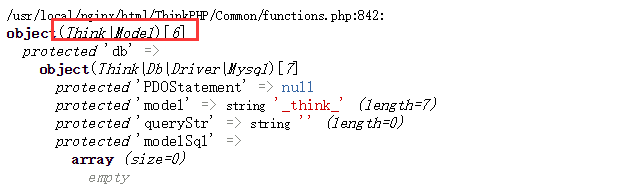
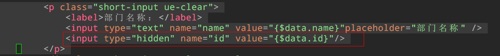
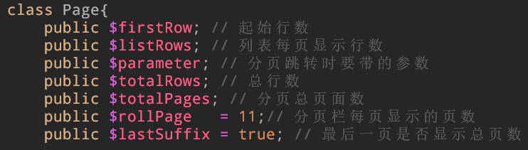
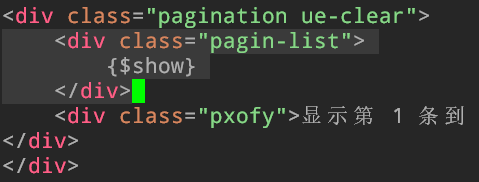

# ThinkPHP框架学习

> zzc
>
> 参考连接：[PHP中文网-ThinkPHP基础实战视频教程](http://www.php.cn/code/25987.html)

这个是国人开发，更好的入门

## 1 MVC模式

MVC强制将项目进行了输入、逻辑、输出进行了分离，分为三部分：控制器(C)、模型层(M)、展示层(V)

## 2 ThinkPHP目录结构

- Application：应用目录
- **Public**：图片、CSS、js等公共文件
- **ThinkPHP**：框架核心目录
  - Common：系统函数目录，里面存放了functions.php
  - Conf：系统配置文件目录
    - convention.php：系统配置文件（系统级别的配置文件）
  - Lang：语言包目录
  - Library：ThinkPHP目录的核心目录
    - Behavior：行文文件目录
    - Org：功能扩展目录
    - Think：Library的核心目录
    - Vendor：第三扩展目录
  - Mode
  - Tpl：系统模板目录，包含了系统使用的模板
  - ThinkPHP.php：项目接口文件，在后期开发的时候需要被项目入口文件所引入
- .htacess：分布式配置文件Apache使用
- composer.json：给composer软件使用的说明文件
- index.php：项目的入口文件

为了在开发中测试数据方便，给入口文件index.php添加一个头部的字符集

```php
// 给入口文件添加一个header头声明字符集
header('Content-Type:text/html;charset="utf-8"');
```

## 3 部署

### 在nginx上部署TP

相比于部署在Apache上，在nginx上进行部署没有那么简单。

进行如下的配置：

> sudo vim /etc/php.ini
>
> 开启：cgi.fix_pathinfo=1
>
> sudo vim /usr/local/nginx/conf/nginx.conf
>
> 修改并添加：

```
    server {
        listen       80;
        server_name  localhost;

        #charset koi8-r;

        access_log  logs/host.access.log  main;

        # pass the PHP scripts to FastCGI server listening on 127.0.0.1:9000
        #
        # ~ \.php 只处理动态请求，对于静态资源请求由下面的 location / 匹配和处理
        location ~ \.php {
			root html;
			fastcgi_pass 127.0.0.1:9000;
			# 包含nginx服务器传递给fastcgi程序的参数，php中通过$_SERVER['参数名']可获取
			include fastcgi.conf;
			# 定义变量$fastcgi_script_name_new赋值为$fastcgi_script_name变量
			set $path_info "";
			set $fastcgi_script_name_new $fastcgi_script_name;
			#判断url是否是pathinfo形式的，如果是则把这个url分割成两部分，index.php入口文件之后的pathinfo部分
			#存入$path_info变量中，剩下的部分和$document_root根目录定位index.php入口文件在文件系统中的绝对路径
			if ($fastcgi_script_name ~*   "^(.+\.php)(/.+)$"  ) {
				set $fastcgi_script_name_new $1;
				set $path_info $2;
			}
			#对fastcgi.conf中的SCRIPT_FILENAME和SCRIPT_NAME fastcgi参数进行重写
			# 目的是指定入口文件在文件系统中的绝对路径给script_filename参数，让fastcgi知道index.php文件位置。
			fastcgi_param   SCRIPT_FILENAME   $document_root$fastcgi_script_name_new;
			fastcgi_param   SCRIPT_NAME   $fastcgi_script_name_new;
			# 定义一个新的nginx服务器传递给fastcgi的参数PATH_INFO
			# thinkphp需要这个入口文件index.php后的pathinfo信息
			fastcgi_param   PATH_INFO $path_info;
        }

        # 用来匹配静态文件
        location / {
            root   html;
            index  index.php index.html index.htm;

            if (!-e $request_filename) {
                rewrite ^(.*)$ index.php?s=$1 last;
                break;
            }   
        }

```

> sudo systemctl restart nginx	#重启nginx服务
>
> sudo systemctl restart php-fpm	#重启php服务
>
> 将官网下载好的ThinkPHP3.2.3-full目录中的ThinkPHP和index.php两个文件放到nginx/html中。直接放入网站根目录。
>
> 同时将html目录修改为0777权限。
>
> 浏览器访问ip，得到如下内容：


同时TP会在wwwroot中创建了一个新的Application目录。

### TP自动创建的Application

- Common：应用级别通用目录
  - common：函数库文件目录目录
  - conf：应用级别的配置
- Home：分组目录，平台目录
  - Common：分组级别的函数库文件目录
  - Conf：分组级别的配置
  - MVC三个目录
- Runtime：临时文件

### 部署之后输出的笑脸

默认分组/平台：Home

> vim /usr/local/nginx/html/Application/Home/Controller/IndexController.class.php


默认控制器：Index

默认方法：index

默认值在系统级别的conf中可以找到配置，如下：

> vim /usr/local/nginx/html/ThinkPHP/Conf/convention.php


## 4 控制器

### 控制器的创建

命名规则：控制器名+Controller.class.php

样例：创建一个用户控制器：UserController.class.php

控制器结构代码：

- 声明当前控制器（类）的命名空间；
- 引入父类控制器（类）；
- 声明控制器（类）并继承父类；

> /usr/local/nginx/html/Application/Home/Controller/UserController.class.php

```php
<?php

namespace Home\Controller;

use Think\Controller;

class UserController extends Controller{

    public function test(){
        phpinfo();
    }
}
?>
```

访问通过普通路由方式进行访问：http://192.168.5.128/index.php?m=Home&c=User&a=test

## 5 路由

**路由指的是访问项目中具体某个方法的URL地址**

TP中有四个路由形式：

- 普通路由（get）：http://网址/入口文件?m=分组名&c=控制名&a=方法名&参数名=参数值
- **Pathinfo路由（默认）**：http://网址/入口文件/分组名/控制器名/方法/参数名1/参数值1/参数名2/参数值2
- Rewrite路由：http://网址/分组名/控制器名/方法/参数名1/参数值1/参数名2/参数值2；不能直接使用，需要配置。
- 兼容路由：http://网址/入口文件?s=分组名/控制器名/方法/参数名1/参数值1/参数名2/参数值2

路由形式的配置：

> /usr/local/nginx/html/ThinkPHP/Conf/convention.php


这个配置影响的是TP系统封装中的URL组装函数（U函数）的生成URL地址。不会影响在地址栏的访问形式。

## 6 分组

通常项目都会根据某个功能的使用对象来区分代码，这些代码放在一起就是分组目录。通常就是我们说的平台（前台、后台）

刚部署好的TP中的/Application/Home就是一个分组目录，如果还需要更多的分组目录，按照Home目录进行创建即可。


创建了一个新的Admin分组目录，在Controller目录中创建了一个新的TestController.class.php文件进行测试，内容如下：

```php
<?php
namespace Admin\Controller;
use Think\Controller;
class TestController extends Controller {
    public function test(){
        echo "hello world.";
    }
}
?>
```

通过Pathinfo路由访问结果：http://192.168.5.128/index.php/Admin/Test/test

输出了hello world.

## 7 控制器的跳转

### URL组装

使用U方法进行url的组装，这个是系统定义的快速方法，位于：/usr/local/nginx/html/ThinkPHP/Common/functions.php中


U函数格式：

> U('[分组名/控制器名/]方法名', array('参数名1' => 参数值1, '参数名2' => 参数值2));

其中生成的url自动会带上.html，这个是因为在系统配置文件中设定默认的伪静态后缀名为.html，是为了优化。

```php
<?php
namespace Admin\Controller;

use Think\Controller;

class TestController extends Controller {
    public function test1(){
        echo U('test1');
    }

    public function test2(){
        echo U('Test/test1');
    }

    public function test3(){
        echo U('Test/test1', array('id' => 100));
    }
}

```

### 系统跳转方法

成功跳转和失败跳转

> $this->success(跳转提示, [跳转地址, 等待时间]);
>
> $this->error(跳转提示, [跳转地址, 等待时间]);

跳转提示必须有，地址和时间可以没有。如果没有地址默认返回上一页。

```php
<?php
namespace Admin\Controller;

use Think\Controller;

class TestController extends Controller {
    public function test(){
        echo "hello world.";
    }

    public function test1(){
        echo U('test1');
    }

    public function test4(){
        $this -> success('success', U('test'), 2);
    }

    public function test5(){
        $this -> error('failed', U('test1'), 2);
    }
}

```


其中this指的是继承的Controller父类。success和error是父类的方法。

## 8 视图

### 视图的创建

创建的位置是分组目录下的View目录与控制器同名的目录中。TestController的test方法需要一个模板，这个模板文件test.html放置的位置是View/Test/test.html

### 视图的展示

Display的语法格式：

> $this -> display();	#展示当前控制器下与当前方法名称一致的模板文件
>
> $this -> display('模板文件名[不带后缀]');	#展示当前控制器下的指定模板文件
>
> $this -> display('View目录下的目录名/模板文件名[不带后缀]');	#展示指定控制器目录下的指定模板文件。

```php
<?php
namespace Admin\Controller;

use Think\Controller;

class TestController extends Controller {
    public function test(){
        echo U('test');
        $this -> display();
    }

    public function test1(){
        echo U('test1');
        $this -> display('test');
    }
}
```

test()和test1()方法访问的都是View/Test/test.html文件。

```html
<html>
    <body>
        <h1>View/Test/test.html</h1>
    </body>
</html>
```

### 变量分配（初阶）

除了展示模板，还需要展示数据。这个变量还存在控制器方法中，需要将数据传递到模板中进行展示，这个过程叫做变量分配。

使用assign方法

> $this -> assign('模板中的变量名', $php中的变量名);

在模板中获取TP变量的默认格式是：**{$变量名}**

```php
<?php
namespace Admin\Controller;

use Think\Controller;

class TestController extends Controller {
    public function test(){
        // 定义变量
        $var = date('Y-m-d H:i:s', time());
        // 变量分配
        $this -> assign('var', $var);
        // 展示模板
        $this -> display();
    }
?>
```

```html
<html>
    <body>
        <h1>View/Test/test.html</h1>
        <h1>var: {$var}</h1>
    </body>
</html>
```

通过访问：http://192.168.5.128/index.php/Admin/Test/test.html得到结果如下：


TP变量的默认分隔符是{}，但是可以通过配置文件进行修改，/usr/local/nginx/html/ThinkPHP/Conf/convention.php


### 模板常量替换机制

在引入图片、css、js文件的时候使用特殊的常量替换复杂的路径。系统提供的常用常量如下：

- _\_MODULE\_\_：从域名后面开始一直到分组名结束的路由
- _\_CONTROLLER\_\_：从域名后面开始一直到控制器结束的路由
- _\_ACTION\_\_：从域名后面开始一直到方法名结束的路由
- _\_PUBLIC\_\_：站点更目录下的PBULIC目录的路由
- _\_SELF\_\_：从域名后面开始一直到最后的路由（如果方法没有传参，跟输出\_\_ACTION\_\_一样）

输入地址：http://192.168.5.129/index.php/Admin/Test/test6/id/100


模板常量是通过模板内容替换机制实现的，不是常量的定义，可以在/usr/local/nginx/html/ThinkPHP/Library/Behavior/ContenReplaceBehavior.class.php中找到定义。


重点是字符串的替换。

目前的项目是在Admin下面，为了在该项目中引入/Public/Admin/中的样式文件更为简单，所以在项目中自定义一个_\_ADMIN__。路径如下：/Appliaction/Common/Conf/config.php:

```php
'TMPL_PARSE_STRING' => array(
    '__ADMIN__' => __ROOT__.'/Public/Admin'   // 站点公共模块下的Admin项目
), 
```

### 综合案例一

使用TP显示如下页面：


1 在/Application/Admin/Controller中创建LoginController.class.php文件：

```php
<?php
namespace Admin\Controller;
use Think\Controller;
class LoginController extends Controller{
    public function login(){
        $this -> display();
    }
}
?>
```

2 在/Application/Admin/View/Login/中创建login.html文件，注意修改路径：href="_\_PUBLIC\_\_/Admin/css/style.css"

```html
<!DOCTYPE html>
<html lang="en" >

    <head>
      <meta charset="UTF-8">
      <title>Login Form</title>
      <link rel="stylesheet" href="__PUBLIC__/Admin/css/style.css">
    </head>

    <body>
      <body>
        <div class="login">
            <div class="login-screen">
                <div class="app-title">
                    <h1>Login</h1>
                </div>
                <div class="login-form">
                    <div class="control-group">
                    <input type="text" class="login-field" value="" placeholder="username" id="login-name">
                    <label class="login-field-icon fui-user" for="login-name"></label>
                    </div>

                    <div class="control-group">
                    <input type="password" class="login-field" value="" placeholder="password" id="login-pass">
                    <label class="login-field-icon fui-lock" for="login-pass"></label>
                    </div>

                    <a class="btn btn-primary btn-large btn-block" href="#">login</a>
                    <a class="login-link" href="#">Lost your password?</a>
                </div>
            </div>
        </div>
      </body>
    </body>
</html>
```

3 **在/Public/Admin/中添加css文件，注意此时的Public是根目录下的公共资源目录，Admin目录是分组目录。**

4访问http://192.168.5.129/index.php/Admin/Login/login得到页面。

### Fetch方法

> $this -> fetch()	# 获取模板的内容

dump方法

> dump($变量名)	# 打印变量内容，封装在函数库文件functions.php中

display()的功能就是fetch() + echo($var)的组合。

```php
<?php
namespace Admin\Controller;
use Think\Controller;
class LoginController extends Controller{
    public function login(){
        // $this -> display();	展示模板页面
        $var = $this -> fetch();	// 获取模板内容
        // dump($var);	// 将变量进行打印
        echo($var);	// 将变量内容进行输出
    }
}
?>
```

### 视图中的注释

在模板中有三种注释方式：

- html注释：\<!-- 这是html注释 -->
- TP的行注释：{// 这是TP行注释}
- TP的块注释：{/\*这是TP块注释*/}

TP的注释是服务器注释，不会在浏览器源代码中被看到，html注释会被看到。在注释中不要出现大括号。

### 变量分配（高阶）

#### 一维数组

定义一个一维数组：

```php
public function test8(){
    $array = array('xixi', 'titi', 'momo', 'poip');
    $this -> assign('array', $array);
    $this -> display();
}
```

数组在模板中的输出语法：

- 中括号形式：{$array[0]}
- 点形式：{$array.key}

```html
<!DOCTYPE html>
<html>
    <body>
        View/Test/test8.html<br />
        中括号形式输出一维数组：{$array[0]} - {$array[1]} - {$array[2]} - {$array[3]}
        点形式输出一维数组：{$array.0} - {$array.1} - {$array.2} - {$array.3}
    </body>
</html>

```

输出结果：


#### 二维数组

二维数组的定义：

```php
$array = array(
    		array('00', '01', '02'),
    		array('10', '11', '12'),
    		array('20', '21', '22')
		);
```

模板输出使用点形式：array.0.0，array.1.1，array.2.2；

#### 对象

首先先创建一个对象，在/Application/Admin/Controller/中创建Student.class.php，如下：

```php
<?php
namespace Admin\Controller;

class Student{
}
?>
```

然后在/Application/Admin/Controller/TestController.class.php中添加方法test9

```php
public function test9(){
    // 实例化student对象
    $stu = new Student();
    // 给类的属性赋值
    $stu -> id = 100;
    $stu -> name = '马冬梅';
    $stu -> sex = '女';
    // dump($stu);
    $this -> assign('stu', $stu);
    $this -> display();
}
```

最后添加模板，其中TP输出对象有两种形式：箭头和冒号。

```html
<!DOCTYPE html>
<html>
    <body>
        View/Test/test9.html<br />
        箭头形式：{$stu -> id} - {$stu -> name} - {$stu -> sex};<br />
        冒号形式：{$stu : id} - {$stu : name} - {$stu : sex};
    </body>
</html>
```

访问地址http://192.168.5.129/index.php/Admin/Test/test9，得到如下结果：


> 这里需要注意命名空间的问题，如果对象定义不写命名空间（也不使用include、require），系统会默认现在当前空间下寻需要的元素，如果找不到就报错。当前的Student和TestController在同一个控制器中，正确。

#### 系统变量

超全局变量在模板中的使用：

- $Think.server：等价于$_SERVER，获取服务器相关信息
- $Think.get：等价于$_GET
- $Think.post：等价于$_POST
- $Think.request：等价于$_REQUEST
- $Think.cookie：等价于$_COOKIE
- $Think.session：等价于$_SESSION
- $Think.config：获取TP中的所有配置文件的总和，如果后面指定了元素，则获取指定元素。

使用语法：

> {$Think.xxx.具体元素的下标}

在TestController.class.php中定义方法进行展示

```php
    public function test10(){
        $this -> display();
    }
```

在模板中：

```html
<html>
    <body>
        $Think.get.id:{$Think.get.id}<br />
        $Think.config.DEFAULT_MODULE:{$Think.config.DEFAULT_MODULE}<br />
    </body>
</html>
```

访问地址http://192.168.5.129/index.php/Admin/Test/test10/id/1000得到结果如下：


### 视图中使用函数

语法格式：

> {$变量 | 函数名1  = 参数1 | 函数名2 = 参数2,  参数3, ###...}

$变量：模板变量

函数名1：需要使用的第一个函数

函数名2：需要使用的第二个函数

参数1：函数名1的参数

参数2， 参数3：函数名2的参数

###：模板变量本身

例子：将time()函数的时间戳通过date函数转换为格式化时间。

TestController.class.php

```php
    public function test11(){
        $time = time();
        $this -> assign('time', $time);
        $this -> display();
    }
```

模板：

```html
<html>
    <body>
        {$time | date = 'Y-m-d H:i:s', ###};
    </body>
</html>
```

例子：截取字符串的前五个字符，同时将其转换为大写。

> {$str | substr=0, 5 | strtoupper};

### 默认值

语法格式：

> {$变量名 | default=默认值};

当变量为空的时候，显示默认值。

### 文件包含

常用于网站的头部和尾部等公共的文件。在不同的文件中通过包含的方式进行引入。

语法：

> \<include file = '需要引入的模板文件' >

创建控制方法：

```php
     public function body(){
     	$this -> display();       
     } 
```

创建head、body、foot三个文件：


```html
<html>
    <head>
        <title>
            body
        </title>
    </head>
    <body>
        <include file='Test/head' />
        <div>do u like this</div>
        <include file='Test/foot' />
    </body>
</html>
```

除了上面的使用方法，include还可以传递值。如下：

```html
<html>
    <head>
        <title>
            body
        </title>
    </head>
    <body>
        <include file='Test/head' />
        <div>do u like this</div>
        <include file='Test/foot' title = 'PHP'/>
    </body>
</html>
```

在foot中传递了参数title，然后在foot.html中使用格式[title]进行输出。如下：

```html
<html>
    <head>
        <title>
            foot
        </title>
    </head>
    <body>
        <div>this is foot[title]</div>
    </body>
</html>
```

上面[title]的值会被替换为include中的title值：PHP

### 遍历元素

在模板中使用\<volist>标签进行元素遍历。

语法如下：

> \<volist name = '需要遍历的模板变量名' id = '当前遍历到的元素' >
>
> // 循环体
>
> \</volist>

```html
<volist name = 'array' id = 'vol'>
	{$vol}
</volist>
```

### if

语法如下：

```html
<body>
    <if condition = '$day == 1'>
    	星期一
	<elseif condition = '$day == 2' />
        星期二
    <elseif condition = '$day == 3' />
        星期三
    </if>
</body>
```

### php标签

在模板中使用PHP标签有两种格式：

- 原始PHP标签：\<?php echo 'hello'; ?>
- TP的PHP标签：\<php> echo 'hello'; \</php>

但是不建议在模板中使用PHP标签

同时可以通过配置项中的TMPL_DENY_PHP进行对原生PHP标签进行禁用，但是不建议关闭，因为有使用原生PHP的源代码。

## 9 模型

### 配置数据库连接

在/ThinkPHP/Conf/convention.php中可以找到对于数据的配置。


但是在这里不会修改系统级别的配置，会将其复制到项目级别的config.php中进行针对每个项目配置。一般一个项目是对应一个数据库的。

路径如下：/Application/Common/Conf/config.php

样例，创建一个db_oa，配置config.php如下：

```php
<?php
return array(
	//'配置项'=>'配置值'
    //
    /* 数据库设置 */
    'DB_TYPE'               =>  'mysql',     // 数据库类型
    'DB_HOST'               =>  'localhost', // 服务器地址
    'DB_NAME'               =>  'db_oa',          // 数据库名
    'DB_USER'               =>  'root',      // 用户名
    'DB_PWD'                =>  '1',          // 密码
    'DB_PORT'               =>  '3306',        // 端口
    'DB_PREFIX'             =>  'sp_',    // 数据库表前缀
);
?>
```

创建表结构如下：


### 模型的创建

模型的作用是跟数据库的数据交互。

命名规范：

> 模型名（不带前缀，首字母大写） + Model.class.php

根据数据库在项目目录/Application/Admin/Model中创建DeptModel.class.php

空模型格式如下：

```php
<?php
namespace Admin\Model;

use Think\Model;

class DeptModel extends Model{

}
?>
```

空模型也能够进行数据库表的基本操作，因为他继承了Model父类。

### 模型的实例化操作

#### 普通的实例化方法

在/Application/Admin/Controller创建一个模型对应的DeptController.class.php控制器。

```php
<?php
// 命名空间声明
namespace Admin\Controller;
// 引入父类控制器
use Think\Controller;
// 声明类并且继承父类
class DeptController extends Controller{
    // 展示实例化的结果
    public function Instantiation(){
        // 普通实例化方法
        $model = new \Admin\Model\DeptModel();
        dump($model);
    }
}
?>
```

普通实例化方法需要使用相对路径去寻找DeptModel。

展示的结果：


#### 快速实例化方法

有两种快速实例化方法：D方法、M方法

D方法格式：

> $obj = D(['模型名']);

实例化自己创建的模型（分组/Model目录）；如果传递了模型名，则实例化指定的模型，如果没有制定或者模型不存在，则直接实力化父类模型（Model.class.php）

M方法格式：

> $obj = M(['不带前缀的表名']);

直接实例化父类模型（Think目录下的Model.class.php）如果指定了表名，则实例化父类模型的时候关联指定的表，如果没有指定表名，则不关联表，一般用于执行原生的sql语句（M() -> query原生的sql语句）。

```php
<?php
// 命名空间声明
namespace Admin\Controller;
// 引入父类控制器
use Think\Controller;
// 声明类并且继承父类
class DeptController extends Controller{
    // 展示实例化的结果
    public function Instantiation(){
        // 普通实例化方法
        // $model = new \Admin\Model\DeptModel();
        //
        // 实例化自定义模型
        // 1
        $model = D('Dept'); // 其实例化结果和普通new是一样的
        // 2
        $model = D();   // 实例化父类模型
        //
        // 实例化父类模型
        // 3
        $model = M('Dept'); // 关联数据表
        // 4
        $model = M();   // 不关联数据表
        dump($model);   
    }
}
?>
```

D()方法传入合法的模型参数，实例化自定义模型同时关联数据表


D()方法不带参数，实例化父类模型同时不关联数据表



M()方法传入合法模型名，实例化父类模型同时关联数据表


M()方法不传入参数，实例化父类模型不关联数据表


### CURD操作

#### 增加操作

mysql使用insert into，TP中使用add方法，格式如下：

> $model -> add(一维数组);

一维数组要求是键值对的数组，键必须和数据表中字段名要匹配，如果不匹配会被TP过滤掉。

add()方法的返回值是主键id。

```PHP
public function Add(){
    // 实例化模型
    $model = M('Dept'); // 直接使用基本的增删改查可以使用父类模型
    // 声明数组
    $data = array(
        'name'  => 'people',
        'pid'   => '0',
        'sort'  => '1',
        'remark'=> 'this is people'
    );
    $result = $model -> add($data);   //增加操作
    dump($result);
}
```

访问地址：http://192.168.5.130/index.php/Admin/Dept/Add查看数据库得到新增数据。

如果需要增加多条数组，可以使用循环的方式或者addAll方法，语法：

> $model -> addAll(二维数组);

二维数组最里面层是关联数组，外层数组必须是下标从0开始的连续索引数组。

#### 修改操作

mysql使用update，TP中使用的save方法，格式：

> $model -> save(一维关联数组);

一维关联数组必须要有**主键信息**。save返回值是影响的行数。

#### 查询操作

mysql使用select，TP中使用select、find。

select格式，返回值是一个二维数组。

> $model -> select();	//全部
>
> $model -> select(id);	//指定id
>
> $model -> select('id1, id2, id3 ...');	//指定id集

find格式，返回值是一个一维数组。

> $model -> find();	//当前表中的第一条记录
>
> $model -> find(id);	//指定id

#### 删除操作

mysql删除使用delete from，TP使用delete方法。格式如下：

> $model -> delete(id);
>
> $model -> delete('id1, id2, id3, ...');

删除分为两种，物理删除，逻辑删除。物理删除是真的删除，逻辑删除只是改变状态，让其查找不到。

## 10 开发实用项

### 跟踪信息

跟踪信息：查看展示系统执行的相关信息。在TP中默认关闭。

配置项：SHOW_PAGE_TRACE，这个选择不在主配置文件中存在，需要自己在项目配置config.php中添加配置。

如：/Application/Common/Conf/config.php添加

```php
'SHOW_PAGE_TRACE'       =>  true
```

访问主页会发现右下角有一个图标：


点击会出来详细信息：


### 两种模式

调试模式：开发调试阶段所使用的模式，错误信息较为详细。

生产模式：上线使用的模式，错误信息比较模糊，使用了缓存，速度会比较快。

配置在入口文件index.php中


### sql调试

可以使用提供的getLastSql()或者_sql方法。格式：

> $model -> getLastSql();
>
> $model -> _sql();

返回最后一条成功执行的sql语句。

也可以查看跟踪信息中的sql选项。

## 11 AR模式

AR模式：Active Record模式，是一个对象-关系映射（ORM）技术。每一个AR类代表一张数据表（或视图），其字段在AR类中体现为类的属性，一个AR实例表示表中的一行。

AR模式的核心：三个映射

- AR类 => 表
- AR类的属性 => 表的字段
- AR类实例 => 表的记录


AR模型的语法格式

// 实例化模型

$model = M(关联的表)；

// 字段映射到属性

$model -> 属性/表中字段 = 字段值；

$model -> 属性/表中字段 = 字段值；

...

// AR实例(操作)映射到表中记录

$model -> CURD操作；

#### AR模式的CURD操作

TP还支持AR模式的CURD操作。AR模式没有查询操作，查询操作需要使用TP原生的select、find操作。

同时，一般修改和删除操作需要指定主键信息，但是如果在这之前使用了TP的select、find查询操作，不指定主键，会直接对查询的数据进行修改和删除操作。所以在进行修改和删除操作的时候一定要指定id，不然会出现奇怪的错误。

如下：

```php
    public function AR_CURD(){
        // 1：类映射表（类关联表）
        $model = M('Dept');
        // 2：属性映射字段
        $model -> name = 'technology';
        $model -> pid = '0';
        $model -> sort = '10';
        $model -> remark = 'this is technology';
        // 3：实例映射记录
        // add
        $result = $model -> add();    // 没有参数
        // save
        $model -> id= '1';            // 修改操作需要确定主键信息
        $result = $model -> save();   // 没有参数
        // delete
        $model -> id= '1';            // 删除操作需要确定主键信息
        $result = $model -> delete(); // 没有参数
        dump($result);
    }

```

在父类中并没有name、pid、sort、remark等属性，但是TP使用PHP中的魔术方法_\_set进行添加。但是add()方法没有传递参数，如何进行添加，是因为add()方法对__set()方法产生的data数据进行了调用。

## 12 辅助方法

但是mysql中除了常见的CRUD操作之外，还有一些类似group、where、order、limit字句，所以TP封装了相应的子句方法。

- where  限制查询的条件
- limit     限制输出的条数
- field      限制输出的字段
- order    按照指定的字段进行指定排序
- group   按照指定的字段进行分组查询

### where方法

语法：

> $model -> where(条件表达式);	//字符串形式、数组形式都可以。
>
> $model -> CURD操作；

条件表示式：where('id > 1');、where('id = 1');

### limit方法

语法：

> $model -> limit(n);	//表示输出的前n行
>
> $model -> limit(起始位置， 偏移量);
>
> $model -> CURD操作；

### field方法

语法：

> $model -> field('字段1， 字段2， 字段3[as 别名] ...');
>
> $model -> CURD操作；

### order方法

语法：

> $model -> order('字段名 排序规则');
>
> $model -> CURD操作；

### group方法

语法：

> $model -> group('字段名');
>
> $model -> CURD操作；

### 连贯操作

将所有的辅助方法写在一行的操作。类似于如下的形式：

> $model -> where() -> limit() -> order() -> field() -> select();

辅助方法的顺序么有要求，只要满足model()在最前面，CURD操作在最后即可。

例如：

```php
// 组合操作
public function test12(){
    $model = M('Dept');
    $model -> group('name');
    $model -> field('name, count(*) as count');
    $data = $model -> select();
    dump($data);
}

// 连贯操作
public function test13(){
    $model = M('Dept');
    $data = $model -> field('name, count(*) as count') -> group('name') -> select();
    dump($data);
}
```

查询结果如下：


### 统计查询

count()\max()\min()\avg()\sum()

## 13 综合案例二

### 显示后台主页

修改模板文件的CSS、JS文件的路径需要全局过一遍，同时将CSS、JS文件放置在Application/Public/Admin/之下，修改CSS、JS文件路径的时候使用_\_PUBLIC__/Admin寻找到对应的文件。

这次的样例中同一个页面有两个模板文件的出现，效果如下：


在/Application/Admin/Controller/中创建IndexController.class.php文件。用于展示index.html和home.html

```php
<?php

namespace Admin\Controller;

use Think\Controller;

class IndexController extends Controller{
    // home 
    public function home(){
        $this -> display();
    }

    // index
    public function index(){
        $this -> display();
    }
}
?>
```

此时使用全路径访问index发现显示正常，但是如果使用默认路径就会出现显示错误的情况。

全路径：http://192.168.5.131/index.php/Admin/Index/index

默认路径：http://192.168.5.131/index.php/Admin/

为了消减这种情况，需要修改index.html中的iframe查找路径。可以使用U()方法添加路径。修改如下：


> 使用U()方法在html文件中的时候，需要使用{:U()}的格式。

### 设置部门管理


修改index.html中的连接跳转路径，使用U()方法


将add.html模块放入到/Application/Admin/View/Dept/中，修改add.html代码，使用volist循环显示：


同时为了让确定和清空内容两个按钮在使用form表单的时候不清除样式，添加jQuery代码。


## 14 模型2

### 数据对象的创建

之前使用了一个_set方法，后面使用另外一个批量设置的create方法，这个方法的语法如下：

> $model -> create()；一般是两个参数都不传入

默认使用post中的数据。

在/Application/Admin/Controller/DeptController.class.php添加Add方法，用于部门的添加。

```php
    public function Add(){
        // 判断请求类型
        if(IS_POST){
            // 处理表单提交
            // $post = I('post.');
            // 写入数据 
            $model = M('Dept');
            // 创建数据对象
            $data = $model -> create(); //不传递参数，则接收post数据
            $result = $model -> add();
            // 判断返回值
            if($result){
                $this -> success('success', U('showList'), 3);
            }else{
                $this -> error('failed');
            }
        }else{
            // 查询出顶级部门
            $model = M('Dept');
            $data = $model -> where('pid = 0') -> select();
            // 传输数据
            $this -> assign('data', $data);
            // 展示
            $this -> display();
        }
    }
```

这里使用了创建数据对象的方法create()。有一个问题是就算没有添加任何的信息，点击添加部门中的确定按钮依然会写入数据，也就是没有进行验证操作。

### 自动验证

TP中有自动验证的方法，但是必须配数据对象使用。验证规则在父类模型中存在一个成员属性，叫做_validate，这个属性是保存验证规则的。由于不能在父类模型中直接更改属性，**所以可以把这个属性复制到子类（自定义模型）中去定义规则**。

在/Application/Admin/Model/DeptModel.class.php中添加自动验证规则。验证规则的格式：

```
array(
	array(验证字段1， 验证规则， 错误提示， [验证条件，附加规则，验证时间]),
	...
)
```

**必选参数：**

**验证字段：表单中每一个表单项的name值；**

**验证规则：就是针对验证字段的要求格式的限制，常见规则有****require 字段必须、email 邮箱、url URL地址、currency 货币、number 数字。**

**错误提示：在验证不合理的时候给用户提示信息。**

可选参数：

验证条件：0表示字段存在就验证（默认），1表示必须验证，2表示字段不为空的时候验证。

附加规则：结合验证规则，两者配合起来使用。具体支持的方法，可以参考手册“自动验证”。

验证时间：1表示新增数据的时候验证，2表示编辑的时候验证，3表示全部情况下都验证（默认）。

/Application/Admin/Model/DeptModel.class.php/：

```php
<?php
namespace Admin\Model;

use Think\Model;

class DeptModel extends Model{
    // 自动验证规则定义
    protected $_validate = array(
        // 针对部门名称的规则，必填，不能重复。
        array('name', 'require', 'empty'),
        array('name', '', 'having', 0, 'unique'),
        // 排序字段验证规则，数字
        array('sort', 'number', 'number'),
    );
}
?>
```

**注意：因为规则是定义在自定义模型中，所以模型在实例化的时候必须需要实例化自定义模型**。也就是使用D()方法，而不是M()方法去实例化。

改写/Application/Admin/Controller/DeptController.class.php/Add()

注意下方的M()方法已经修改为D()方法。

```php
public function Add(){
        // 判断请求类型
        if(IS_POST){
            // 写入数据 
            $model = D('Dept');
            // 创建数据对象
            $data = $model -> create(); //不传递参数，则接收post数据
            // 1判断验证结果
            if(!$data){
                // 提示用户验证失败
                $this -> error($model -> getError());
                exit;
            }

            $result = $model -> add();
    }
```

### 字段映射

这种方法是为了提高安全性。例如表单中的name的值和数据表中的字段名都是一样的，这样可以通过name的值猜测出数据表的名字和结构，所以使用一个随机的字符映射了真实的值，这样就安全性更高。

> $_map = array();

## 15 验证码类

Verify.class.php就是TP中的验证码类，其中常见的方法：Check()\Entry()

### 生成常规验证码

```php
    public function test14(){
        // 配置
        $cfg = array(
                'fontSize' => 12,   // 验证码字体大小
                'useCurve' => false,// 是否混淆曲线
                'useNoise' => false,// 是否添加杂点
                'length' => 4,      // 验证码位数
                // 'fontttf' => '4.ttf',  // 验证码字体，不设置就随机
        );
        // 实例化验证码类
        $verify = new \Think\Verify($cfg);
        // 输出验证码
        $verify -> entry();
    }
```

## 16 综合案例三

### 实现后台登陆功能

在/Application/Admin/Controller/PublicController.class.php添加captcha()方法，用于输出验证码：

```php
    public function captcha(){
        // 配置
        $cfg = array(
                'fontSize' => 12,   // 验证码字体大小
                'useCurve' => false,// 是否混淆曲线
                'useNoise' => false,// 是否添加杂点
                'length' => 4,      // 验证码位数
                'imageW' => 90,      
                'imageH' => 38,      
                // 'bg' => array(93, 202, 27),      
                'fontttf' => '4.ttf',  // 验证码字体，不设置就随机
        );
        // 实例化验证码类
        $verify = new \Think\Verify($cfg);
        // 输出验证码
        $verify -> entry();
    }
```

在/Application/Admin/View/Public/login.html中输出验证码，同时给图片绑定点击事件，让其点击更新验证码。

```html
<p class="yzm ue-clear">
    <label>验证码</label>
    <input type="text" name="captcha" maxlength="4"/>
    <cite></cite>
</p>
```

创建用户表：


在/Application/Admin/Controller/PublicController.class.php中添加checkLogin()方法，用于验证用户的登录。

```php
//checkLogin
public function checkLogin(){
    // 获取数据
    $post = I('post.');
    // 验证验证码
    $verify = new \Think\Verify();
    // 验证
    $result = $verify -> check($post['captcha']);
    if($result){
        // 验证码正确，处理用户名和密码
        $model = M('User');
        // 删除验证码信息
        unset($post['captcha']);
        // 查询
        $data = $model -> where($post) -> find();
        // 判断用户存在
        if($data){
            // 用户存在，将信息持久化保存在session中，跳转后台
            session('id', $data['id']);
            session('username', $data['username']);
            session('role_id', $data['role_id']);
            $this -> success('success', U('Index/index'), 2);
        }else{
            $this -> error('username or password error');
        }
    }else{
        $this -> error('verify error');
    }
}
```

修改login.html中，对用户名处添加form标签，用于表单提交。添加name属性，修改登录的href标签，使用jQuery进行表单的提交。


```js
$(function(){
    $('.btn').on('click', function(){
        $('form').submit();
    });
});
```

完善细节，修改显示的用户名并且修改跳转地址。

在PublicController.class.php中添加logout方法：

```php
public function logout(){
    // 清空session
    session(null);
    // 跳转到登陆界面
    $this -> success('logout success', U('login'), 2);
}
```

修改/Application/Admin/View/Public/index.html中的退出跳转地址，发现跳转定义在/Application/Public/js/index.js中，所以修改跳转地址如下：


> TP规定，不能在JS、CSS等非模板文件中使用任何模板引擎的东西。

### 添加部门展示功能

在DeptController.class.php中添加方法showList：

```php
public function showList(){
    // 模板实例化
    $model = M('Dept');
    // 查询
    $data = $model -> order('sort asc') -> select();
    // 二次遍历查询顶级部门
    foreach ($data as $key => $value){
        if ($value['pid'] > 0){
            // 查询pid对应的部门
            $info = $model -> find($value['pid']);
            // 只需要保存其中的name
            $data[$key]['deptname'] = $info['name'];
        }
    }
    // 传递模板
    $this -> assign('data', $data);
    // 显示模板
    $this -> display();
}
```

将showList.html放入/View/Dept/中，修改静态资源路径。修改为动态获取显示内容。

```html
<tbody>
    <volist name='data' id='vol'>
        <tr>
            <td class="num">{$vol.id}</td>
            <td class="name">{$vol.name}</td>
            <td class="process">
                <if condition='$vol.pid == 0'>顶级部门<else/>{$vol.deptname}</if>
            </td>
            <td class="node">{$vol.sort}</td>
            <td class="time">{$vol.remark}</td>
            <td class="operate"><a href="javascript:;">查看</a></td>
        </tr>
    </volist>
</tbody>
```

### 完成部门编辑功能

在DeptContorller.class.php中添加edit方法：

```php
    public function edit(){
        // 保存数据
        if(IS_POST){
            // 处理post
            $post = I('post.');
            // 实例化
            $model = M('Dept');
            // 保存操作
            $result = $model -> save($post);
            if($result !== false){
                // 成功
                $this ->success('edit success', U('showList'), 3);
            }else{
                $this -> error('edit failed');
            }
        }else{
            // 接收id
            $id = I('get.id');
            // 实例化模型
            $model = M('Dept');
            // 查询部门信息
            $data = $model -> find($id);
            // 查询全部部门信息，给下拉列表使用
            $info = $model -> where("id != $id") -> select();
            // 变量分配
            $this -> assign('data', $data);
            $this -> assign('info', $info);
            // 展示
            $this -> display();
        }
    }
```

处理表单页面：

隐藏域：**因为系统限制不能执行批量修改，所以修改的时候必须指定主键，这也就是指定要求添加一个隐藏域，来传递id**



使用jQuery绑定点击事件

```js
$(function(){
    $('.confirm').on('click', function(){
        $('form').submit();
    });

    $('.clear').on('click', function(){
        $('form')[0].reset();
    });
});
```

添加下拉菜单显示上级部门：

```php
	    	<label>上级部门：</label>
	        <div class="select-wrap">
	        	<select name="pid">
	                <option value="0">顶级部门</option>
                    <volist name='info' id='vol'>
                    <option value="{$vol.id}" <if condition='$vol.id == $data.pid'>selected="selected"</if>>{$vol.name}</option>
	            </select>
	        </div>
```

### 添加部门删除功能

showList.html中给列表的每一行添加一个复选框，用于选择删除：

```html
<td class="operate">
    <input type="checkbox" class="deptid" value="{$vol.id}" />
    ...
</td>
```

实现点击删除按钮就可以删除的功能。这里需要使用到jQuery，获取del的点击事件进行处理

```js
// jQuery
$(function(){
    // 给删除按钮绑定点击事件
    $('.del').on('click', function(){
        // 事件处理程序
        var idObj = $(':checkbox:checked'); // 获取全部已经被选择的checkbox
        var id = '';    // 接收处理后的部门id值，组成id1, di2...
        // 循环遍历idObj对象，获取其中的每一个值
        for (var i = 0; i < idObj.length; i++) {
            id += idObj[i].value + ',';
        }
        // 去掉最后的逗号
        id = id.substring(0, id.length - 1);
        // 带着参数跳转到del方法中
        window.location.href = '__CONTROLLER__/del/id/' + id;
    });
});
```

在DeptController.class.php中添加del方法进行删除。

```php
    public function del(){
        $id = I('get.id');

        $model = M('Dept');

        $result = $model -> delete($id);

        if ($result){
            $this -> success('delete success');
        }else{
            $this -> error('delete failed');
        }
    }
```

### 添加职员管理

修改index.html中的左侧菜单栏。

```html
<li class="nav-info">
    <div class="nav-header"><a href="javascript:;" class="ue-clear"><span>职员管理</span><i class="icon"></i></a></div>
    <ul class="subnav">
        <li><a href="javascript:;" date-src="{:U('User/showList')}">职员列表</a></li>
        <li><a href="javascript:;" date-src="{:U('User/add')}">添加职员</a></li>
    </ul>
</li>
```

重新导入db_oa中的数据：


创建UserController.class.php添加add方法，同时增加add.html模板。

add.html中添加选项：

```html
<select name="dept_id">
    <option value="-1">请选择</option>
    <foreach name='data' item='fo'>
        <option value="{$fo.id}">{$fo.name}</option>
    </foreach>
</select>
```

add()方法：

```php
public function add(){
    if(IS_POST){
        $model = M('User');
        $data = $model -> create();
        $data['addtime'] = time();
        $result = $model -> add($data);
        if($result){
            $this -> success('add success', U('showList'), 3);
        }else{
            $this -> error('add failed');
        }
    }else{
        $data = M('Dept') -> field('id, name') -> select();
        $this -> assign('data', $data);
        $this -> display();
    }
}
```

在UserController.class.php中添加showList()方法，将showList.html放入到模板中。

showList()方法：

```php
public function showList(){
    $data = M('User') -> select();

    $this -> assign('data', $data);

    $this ->display();
}
```

修改showList.html进行循环显示：

```html
<volist name='data' id='vol'>
    <tr>
        <td class="id">{$vol.id}</td>
        <td class="name">{$vol.username}</td>
        <td class="nickname">{$vol.nickname}</td>
        <td class="dept_id">{$vol.dept_id}</td>
        <td class="sex">{$vol.sex}</td>
        <td class="birthday">{$vol.birthday}</td>
        <td class="tel">{$vol.tel}</td>
        <td class="email">{$vol.email}</td>
        <td class="addtime">{$vol.addtime|date='Y-m-d H:i:s', ###}</td>
        <td class="operate"><a href="javascript:;">查看</a></td>
    </tr>
</volist>
```

## 17 分页功能

TP中封装了一个分页类：Page.class.php

分页类中包含了如下属性：



包含如下方法：构造方法；SetConfig()方法；Show()方法；

### 分页的方法


**第一步：查询出总的记录数；**

**第二步：实例化分页类，由于底层实现要求实例化的时候至少需要传递总数，所以需要在实例化的时候传递参数；**

**第三步：（可选步骤）定制显示分页提示的文字；**

**第四步：通过show方法输出分页页码的连接；**

**第五步：使用limit方法进行分页查询，注意其参数是page类的属性；**

**第六步：使用assign将查询的数据和分页连接数据传递给模版；**

**第七步：输出模版；**

### 综合案例四

在UserController.class.php中定义方法showList()，其中定义了分页的方法。

```php
public function showList(){
    // 模型实力化
    $model = M('User');
    // 分页第一步：查询总的记录数
    $count = $model -> count();
    // 分页第二步：实例化分页类，传递参数
    $page = new \Think\Page($count, 1); // 每页显示1个
    // 分页第三步：可选步骤，定义提示文字
    $page -> rollPage = 5;
    $page -> lastSuffix = false;
    $page -> setConfig('prev', '上一页');
    $page -> setConfig('next', '下一页');
    $page -> setConfig('last', '末页');
    $page -> setConfig('first', '首页');
    // 分页第四步：show方法生成url
    $show = $page -> show();
    // 分页第五步：展示数据
    $data = $model -> limit($page->firstRow, $page->listRows) -> select();
    // 分页第六步：传递给模板
    $this -> assign('data', $data);
    $this -> assign('show', $show);
    // 分页第七步：展示模板
    $this -> display();
}
```

Show方法返回值类似于下面的这种形式：


设置首页和末页的时候需要注意，如果总的页码数小于分页类中rollPage属性，则不会显示首页和末页的按钮，这个时候需要修改rollPage的值；由于分页类中lastSuffix属性，定义最后一页显示总页数，所以将其改为false

修改showList.html文件，让其显示show变量。



效果如下：


## 18 连表查询

### table方法

原生的sql语句查询

```php
public function test15(){
    $model = M();
    $sql = "select t1.*, t2.name as deptname from sp_user as t1, sp_dept as t2 where t1.dept_id = t2.id;";
    $result = $model -> query($sql);
}
```

table的语法：

> $model -> table(‘表名1 [as 别名1],表名2 [as 别名2]…’);	//table方法也是连贯操作中的一个辅助方法。在使用table方法之后模型会自动关联上table方法中指定的数据表。

使用table进行查询：

```php
public function test16(){
    $model = M();
    $result = $model -> field('t1.*, t2.name as deptname') -> table('sp_user as t1, sp_dept as t2') -> where('t1.dept_id = t2.id') -> select();
}
```

### join方法


原生的sql：**select t1.\*,t2.name as deptname from sp_dept as t1 left join sp_dept as t2 on t1.pid = t2.id;**

Join的语法：

> $model -> join(‘联表方式 join 表名 [as 别名] on 表1.字段 = 表2.字段’);	//join方法也是连贯操作的辅助方法之一，只有一个参数。

```php
public function test17(){
    $model = M();
    $result = $model -> field('t1.*, t2.name as deptname') -> alias('t1') -> join('left join sp_dept as t2 on t1.pid = t2.id') -> select();
}
```

## 19 综合案例五

### 实现文案添加和展示

创建数据表sp_doc：


修改Index/index.html中的公文管理导航菜单栏：

```html
<li class="gongwen">
    <div class="nav-header"><a href="javascript:;" class="ue-clear"><span>公文管理</span><i class="icon"></i></a></div>
    <ul class="subnav">
        <li><a href="javascript:;" date-src="{:U('Doc/showList')}">公文列表</a></li>
        <li><a href="javascript:;" date-src="{:U('Doc/add')}">添加公文</a></li>
    </ul>
</li>
```

创建控制器DocController.class.php，添加add方法，将add.html移动到View/Doc/中：

```php
<?php

namespace Admin\Controller;

use Think\Controller;

public function add(){
    if(IS_POST){
        // 处理提交
        $post = I('post.');
        // 补全字段addtime
        $post['addtime'] = time();
        // 实例化模型
        $model = M('Doc');
        $result = $model -> add($post);
        if($result){
            // 成功并实现跳转
            $this -> success('add success', U('showList'), 3);
        }else{
            $this -> error('add failed');
        }
    }
    else{
        $this -> display();
    }
}
?>
```

将showList.html文件移动到View/Doc中，同时在DocController.class.php中添加showList()方法。

```php
public function showList(){
    $model = M('Doc');
    $data = $model -> select();
    $this -> assign('data', $data);
    $this -> display();
}
```

修改showList.html显示内容：

```html
<tbody>
    <volist name='data' id='vol'>
        <tr>
            <td class="id">{$vol.id}</td>
            <td class="name">{$vol.title}</td>
            <td class="file"></td>
            <td class="content">{$vol.author}</td>
            <td class="addtime">{$vol.addtime|date='Y-m-d H:i:s', ###}</td>
            <td class="operate">
                <a href ='javascript:;'>查看</a> 
            </td>
        </tr>
    </volist>
</tbody>
```

查看内容的时候发现：


较长的标题出现了换行的现象，为了美观。自定义了一个函数文件，其中已经封装好了一个msubstr的函数，该函数可以进行中文截取：将function.php放到指定的位置（放到应用级别的目录中/Application/Common/common）这样就可以在项目中直接使用该函数。

修改showList.html中title的显示：


### ueditor富文本编辑器

官网下载php的utf-8版本，然后放到Public/Admin/Plugin/ue中


其中的index.html是一个完整的demo，可以通过他知道如何在php中使用ueditor。

目前打算使用ue代替add.html中的文本框。

首先在add.html中引入三个在ue中需要的js文件：


然后在内容位置替换ue的位置代码。


最后实例化ue。


输出结果如下：


最后进行微调：

通过dump查看了提交的内容发现：


ue默认提交的字段值是editorValue，这个跟我们设定的content字段不一样，所以需要在script中添加字段name='content'，这样保证跟数据库的表字段一样。

如果上传了图片，会在ue/php/config.json中指定的路径中进行保存图片。


因为保存到数据库中的内容是转码之后的格式，此处的转码，是由ThinkPHP的I方法进行转化的，使用的是htmlspecialchars。在读取的时候需要将数据表中实体字符进行还原，可以使用函数**htmlspecialchars_decode**。


### 添加上传文件功能

在TP中有一个上传类：Upload.class.php，在上传文件的时候有一个核心的操作就是移动临时文件（move_upload_file）。上传类中有几个函数：getError方法；uploadOne方法；upload方法

在进行文件上传的表单中需要注意如下几个点：

- form中必须有enctype="multipart/form-data"属性，该属性表示不会进行任何编码。
- form中的文件域必须要type="file"。
- form必须使用method="post"的方式进行提交。


