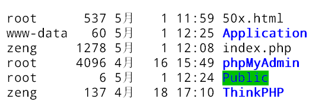
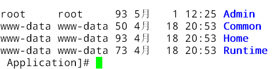
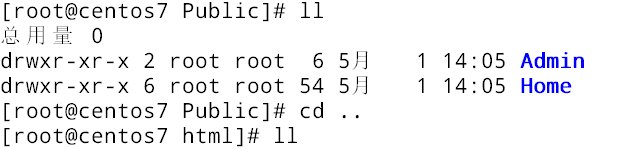

## 后台流程全记录

> zzc

本文用于记录在虚拟机centos  7上进行的所有文件操作。

### 19.5.1

#### 站点部署

ThinkPHP部署好之后通过浏览器访问路径的方式会自动创建一个起始目录Home，默认创建IndexController.class.php及方法index，访问ip或者域名的方式可以直接访问到该方法。利用这一点可以将前台页面通过index方法展示。同时复制Home为Admin目录，作为后台管理项目。

这样当前有两个项目，一个是Home作为前台展示项目，一个是Admin作为后台管理项目。

站点根目录下目录结构，index.php是TP的入口文件，phpMyAdmin是mysql管理工具。Application是项目目录。Public用于存放静态文件如css、js、images等。



Home是前台展示项目，Admin是后台管理项目。Common是公共配置目录。Runtime是运行时临时文件目录，存放数据库缓存等。



#### 部署前端展示Home项目

**19.5.1**

添加静态文件到Public中。



将当前的展示页面放入到/Home/View中。


修改/html/Application/Common/Conf/config.php项目配置文件。：

```php
<?php

return array(
	//'配置项'=>'配置值'
    'TMPL_PARSE_STRING' => array(
        '__HOME__' => __ROOT__.'/Public/Home',  // 站点公共模块下的Admin项目
        '__ADMIN__' => __ROOT__.'/Public/Admin' // 站点公共模块下的Admin项目
    ), 
    //
    /* 数据库设置 */
    'DB_TYPE'               =>  'mysql',     // 数据库类型
    'DB_HOST'               =>  'localhost', // 服务器地址
    'DB_NAME'               =>  'graduation',          // 数据库名
    'DB_USER'               =>  'root',      // 用户名
    'DB_PWD'                =>  '1',          // 密码
    'DB_PORT'               =>  '3306',        // 端口
    'DB_PREFIX'             =>  '',    // 数据库表前缀

    // 'SHOW_PAGE_TRACE'       =>  true
);
```

修改/html/Application/Home/Controller/IndexController.class.php：

```php
<?php
namespace Home\Controller;
use Think\Controller;
class IndexController extends Controller {
    public function index(){
        $this->display();
    }
}
```

使用__HOME\_\_修改index.html中的css、js、images引用路径。如下：


访问本机ip：http://192.168.5.133/首页展示页面：


到这里简单的首页访问算是成功了，但是index.html主页面中的链接还没有做好，为了实现各种功能的跳转，还需要使用PHP代码修改index.html页面。