## 后台流程记录

> zzc

本文用于记录在虚拟机centos  7上进行的所有文件操作。

### 19.5.1

#### 站点部署

ThinkPHP部署好之后通过浏览器访问路径的方式会自动创建一个起始目录Home，默认创建IndexController.class.php及方法index，访问ip或者域名的方式可以直接访问到该方法。利用这一点可以将前台页面通过index方法展示。同时复制Home为Admin目录，作为后台管理项目。

这样当前有两个项目，一个是Home作为前台展示项目，一个是Admin作为后台管理项目。

站点根目录下目录结构，index.php是TP的入口文件，phpMyAdmin是mysql管理工具。Application是项目目录。Public用于存放静态文件如css、js、images等。

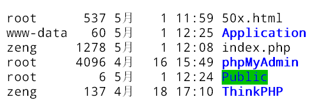

Home是前台展示项目，Admin是后台管理项目。Common是公共配置目录。Runtime是运行时临时文件目录，存放数据库缓存等。

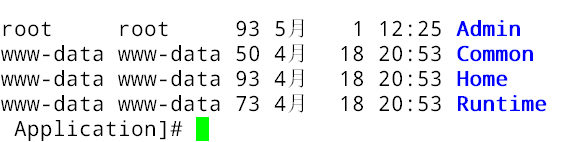

#### 部署前端展示Home项目

添加静态文件到Public中。

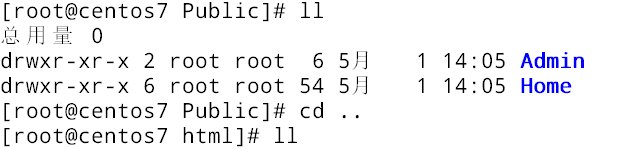

将当前的展示页面放入到/Home/View中。

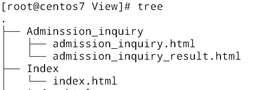

修改/html/Application/Common/Conf/config.php项目配置文件。：

```php
<?php

return array(
	//'配置项'=>'配置值'
    'TMPL_PARSE_STRING' => array(
        '__HOME__' => __ROOT__.'/Public/Home',  // 站点公共模块下的Admin项目
        '__ADMIN__' => __ROOT__.'/Public/Admin' // 站点公共模块下的Admin项目
    ), 
    //
    /* 数据库设置 */
    'DB_TYPE'               =>  'mysql',     // 数据库类型
    'DB_HOST'               =>  'localhost', // 服务器地址
    'DB_NAME'               =>  'graduation',          // 数据库名
    'DB_USER'               =>  'root',      // 用户名
    'DB_PWD'                =>  '1',          // 密码
    'DB_PORT'               =>  '3306',        // 端口
    'DB_PREFIX'             =>  '',    // 数据库表前缀

    // 'SHOW_PAGE_TRACE'       =>  true
);
```

修改/html/Application/Home/Controller/IndexController.class.php：

```php
<?php
namespace Home\Controller;
use Think\Controller;
class IndexController extends Controller {
    public function index(){
        $this->display();
    }
}
```

使用__HOME\_\_修改index.html中的css、js、images引用路径。如下：

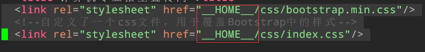

访问本机ip：http://192.168.5.133/首页展示页面：

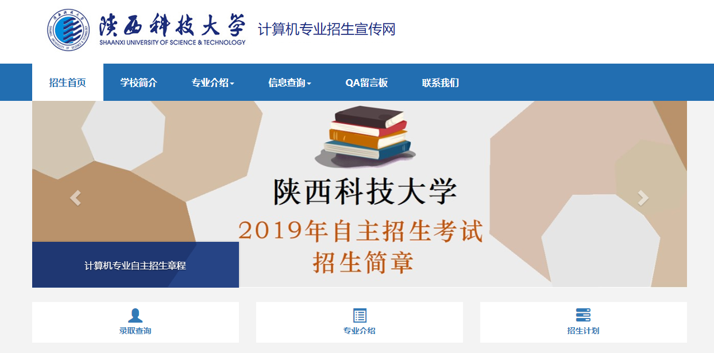

到这里简单的首页访问算是成功了，但是index.html主页面中的链接还没有做好，为了实现各种功能的跳转，还需要使用PHP代码修改index.html页面。

### 19.5.5

#### 配置域名访问

> [参考连接](https://www.cnblogs.com/biaopei/p/7730516.html)

centos 7虚拟机中：

修改/nginx/cong/nginx.conf中的虚拟服务配置。让127.0.0.1配置www.zeng.com域名。

```nginx
    server {
        listen       80;
        server_name  www.zeng.com;
```

修改/etc/hosts文件，给127.0.0.1配置本地DNS

```
127.0.0.1   localhost localhost.localdomain localhost4 localhost4.localdomain4 www.zeng.com
::1         localhost localhost.localdomain localhost6 localhost6.localdomain6
```

使用命令重启网络：

```shell
systemctl restart network.service
systemctl restart nginx.service
```

foxfire访问域名成功。

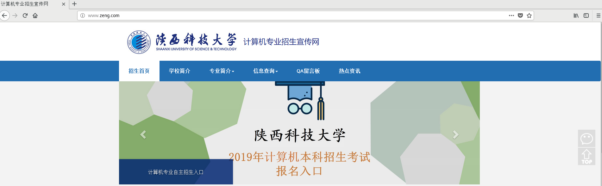

Windows主机中：

修改C:\Windows\System32\drivers\etc\hosts文件，让虚拟机的ip绑定域名www.zeng.com。

> 192.168.5.133	www.zeng.com

这样本机使用浏览器访问www.zeng.com也可以访问到虚拟机的Nginx服务。

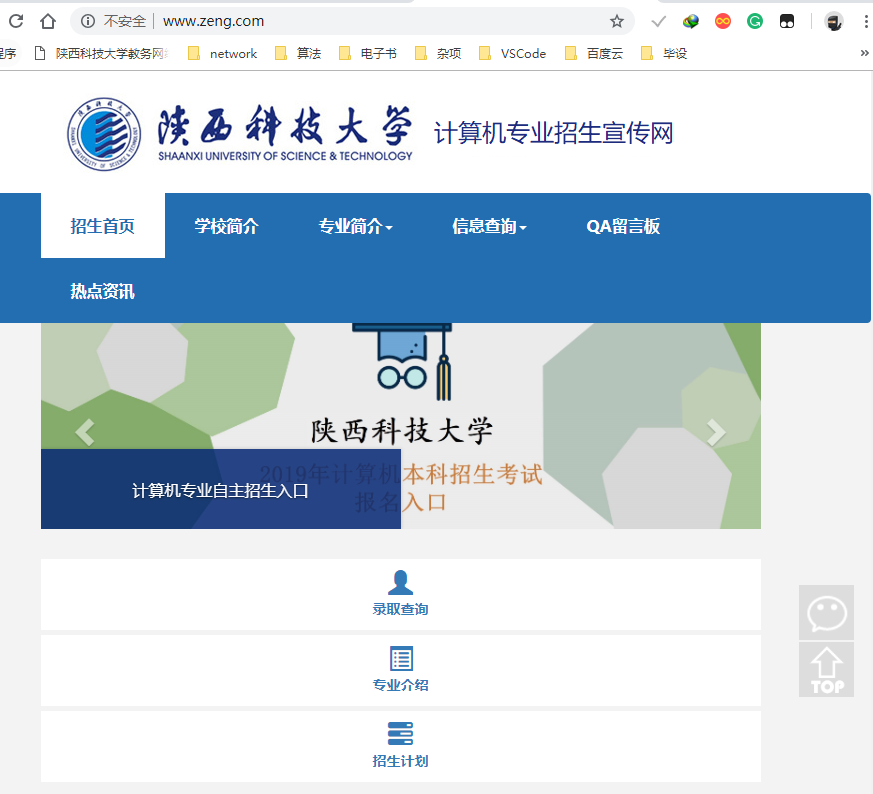

#### 配置TP的URL重写

> [参考资料](http://document.thinkphp.cn/manual_3_2.html#bind_index)

现在项目有两部分组成：前台展示页面（www.zeng.com）直接访问，后台管理员界面（http://www.zeng.com/index.php/Admin/Login/login）访问。但是这样访问太麻烦，需要经过index.php这个入口文件。所以配置nginx.conf让其重写。

```nginx
        location / {
            root   html;
            index  index.php index.html index.htm;

            if (!-e $request_filename) {
                rewrite ^(.*)$ /index.php?s=$1 last;
                break;
            }   
        }
```

代码中的rewrite将index.php自动写入，这样访问就不需要加上index.php入口文件。但是这样访问后台登录页面还是麻烦，所以配置管理员入口文件。这样更加方便。

复制index.php入口文件为admin.php，修改admin.php内容如下：

```php
// 给入口文件添加一个header头声明字符集
header('Content-Type:text/html;charset="utf-8"');

// 检测PHP环境
if(version_compare(PHP_VERSION,'5.3.0','<'))  die('require PHP > 5.3.0 !');

// 开启调试模式 建议开发阶段开启 部署阶段注释或者设为false
define('APP_DEBUG',True);

// 绑定访问Admin模块
define('BIND_MODULE', 'Admin');
// 绑定访问Login控制器
define('BIND_CONTROLLER', 'Login');
// 绑定访问login方法
define('BIND_ACTION', 'login');

// 定义应用目录
define('APP_PATH','./Application/');

// 定义工作路径
define('WORKING_PATH', __DIR__);

// 定义上传路径
define('UPLOAD_ROOT_PATH', '/Public/Uploads/');

// 引入ThinkPHP入口文件
require './ThinkPHP/ThinkPHP.php';

// 亲^_^ 后面不需要任何代码了 就是如此简单
```

在这里绑定了入口访问的模块为Admin、控制器为Login、方法为login。注意这里一定要真实存在上述三个文件。绑定之后即可实现通过url：www.zeng.com/admin.php直接访问后台管理页面的登录界面。

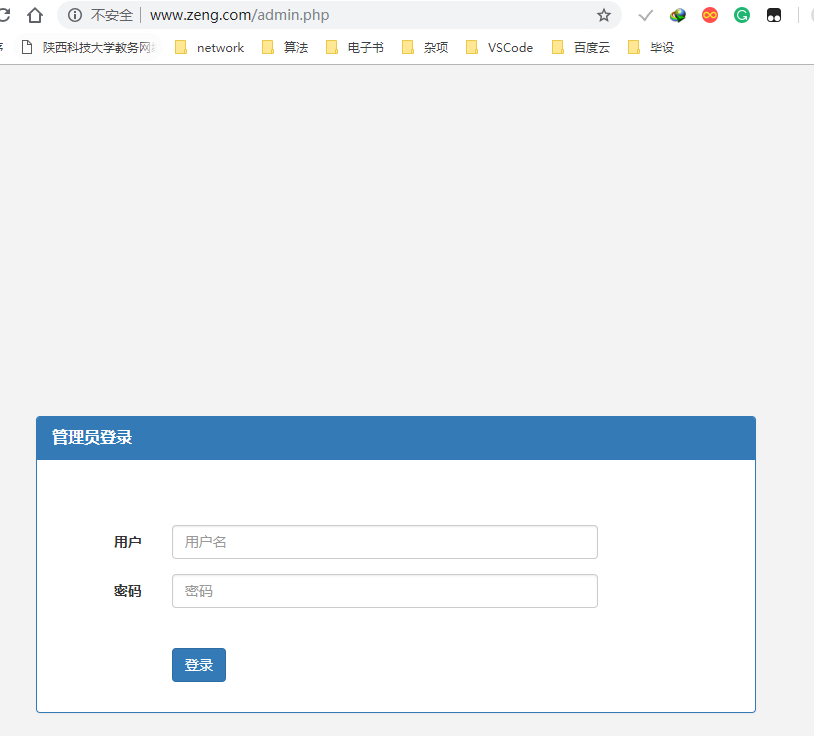

### 19.5.6

新增Controller(/Application/Admin/Controller):

1. LoginController.class.php: checkLogin();
2. IndexController.class.php: index();

新增View(/Application/Admin/View)：

1. Admin: index.html

问题：

1. 在checkLogin()方法中出现一个问题：如果使用admin.php进入的话，生成的URL不正确，不能跳转到checkLogin。例如下面两个例子：www.zeng.com/admin.php调用；www.zeng.com/Admin/Login/login调用；两种调用后台登陆界面的方式导致这里产生的URL不同。后面这种是可以正确跳转到checkLogin方法的。
2. 在实现主页面的左右分栏的时候遇到问题，ThinkPHP的ajax方法需要另外处理：[参考连接](http://www.thinkphp.cn/topic/52612.html)。

实现：

1. 登录显示后台主页面。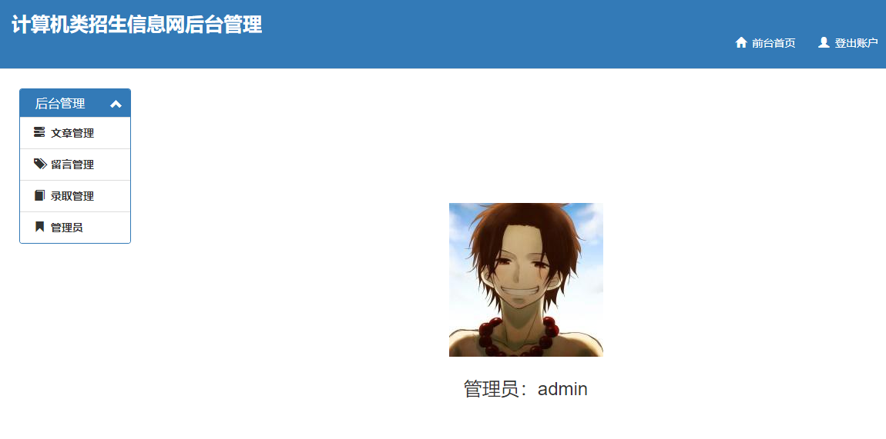

2. 管理员信息从数据库中获取并显示：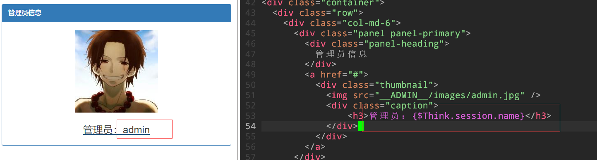

3. 实现点击左边分栏更新右边内容。这里使用了ThinkPHP中的ajax方法。需要阻止a标签中的href浏览器默认行为。代码如下：

   ```html
   
   ```

   