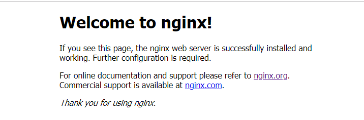
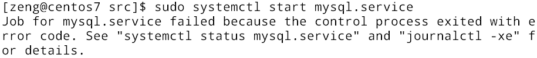
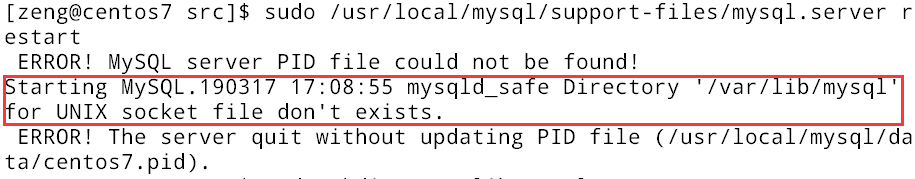
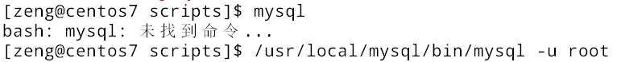
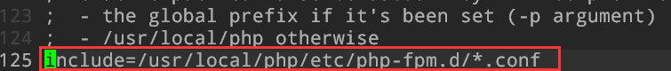
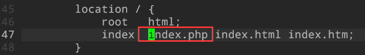
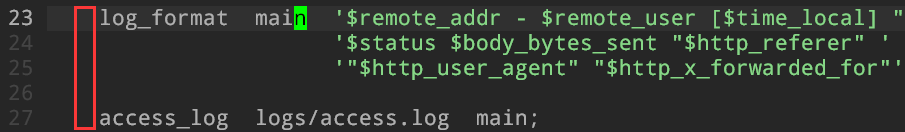
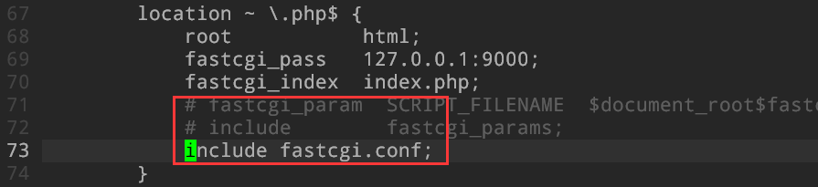
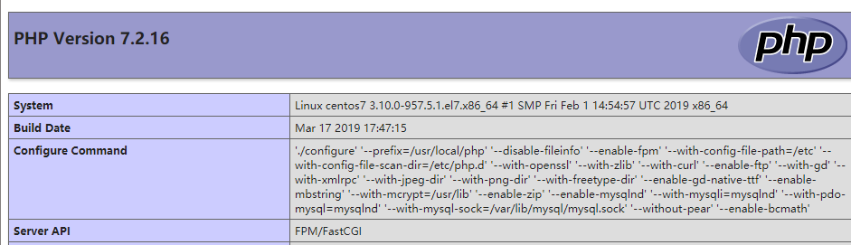
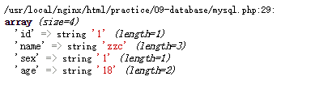

# 安装并测试LNMP环境

> zzc

### 1 检查安装必备环境

> sudo yum -y install gcc automake autoconf libtool make gcc-c++ glibc

### 2 安装nginx

#### 2.1 安装nginx依赖

> nginx的Rewrite模块和HTTP核心模块会使用到PCRE正则表达式语法：
>
> sudo yum -y install pcre pcre-devel
>
> nginx的各种模块中需要使用gzip压缩：
>
> sudo yum -y install zlib zlib-devel
>
> 安全套接字层密码库：
>
> sudo yum -y install openssl openssl-devel

#### 2.2 下载nginx并编译安装

下载目录：/usr/local/src，安装目录：/usr/local/nginx

> // 下载解压
>
> cd /usr/local/src
>
> sudo wget http://nginx.org/download/nginx-1.12.2.tar.gz
>
> sudo tar -zxvf nginx-1.12.2.tar.gz
>
> // 安装
>
> cd nginx-1.12.2
>
> sudo ./configure --prefix=/usr/local/nginx
>
> sudo make && sudo make install

#### 2.3 创建并设置nginx运行用户

创建用户的意义在于权限管理

> sudo groupadd nginx
>
> sudo useradd -M -g nginx -s /sbin/nologin nginx
>
> cd /usr/local/nginx/conf
>
> sudo vim nginx.conf，添加user参数如下：
>
> user nginx nginx

#### 2.4 设置nginx为系统服务

> sudo vim /lib/systemd/system/nginx.service
>
> 文件内容：
>
> [Unit]
>
> Description=nginx
>
> After=network.target
>
> [Service]
>
> Type=forking
>
> ExecStart=/usr/local/nginx/sbin/nginx
>
> ExecReload=/usr/local/nginx/sbin/nginx -s reload
>
> ExecStop=/usr/local/nginx/sbin/nginx -s stop
>
> PrivateTmp=true
>
> [Install]
>
> WantedBy=multi-user.target

#### 2.5 设置nginx开机自启动

> sudo systemctl enable nginx.service

#### 2.6 开启nginx服务，查看是否成功

> sudo systemctl start nginx.service
>
> ps aux | grep nginx

#### 2.7 开放防火墙80端口

nginx默认使用80端口，可以在nginx.conf中配置，用于远程访问

> 永久开放80端口：
>
> sudo firewall-cmd --zone=public --add-port=80/tcp --permanent
>
> 重启防火墙：
>
> sudo firewall-cmd --reload
>
> 查看防火墙开启状态：
>
> sudo systemctl status firewalld
>
> 查看80端口是否开放成功：
>
> sudo firewall-cmd --zone=public --query-port=80/tcp

firewall-cmd选项解析

> --zone #作用域 
>
> --add-port=80/tcp #添加端口，格式为：端口/通讯协议 
>
> --permanent #永久生效，没有此参数重启后失效 

#### 2.8 访问nginx

主机浏览器使用http访问虚拟机ip并加上port80访问

> http://192.168.5.128:80（不能使用https，此时还没有安装https使用的证书，只能使用http）



### 3 安装Mysql

#### 3.1 卸载预安装版本

centos 7预安装的mysql版本不高，同时如果没有安装mysql却存在mysql的文件，会让安装过程出现各种bug。一般来说centos 7安装mysql的替代版本mariadb，但是mysql更熟悉同时也更好用。

> 卸载已有mysql
>
> 查看是否已安装mysql：rpm -qa | grep mysql
>
> 有则卸载：sudo rpm -e --nodeps 文件名
>
> 是否存在与mysql相关的文件或目录：whereis mysql
>
> 是则删除。
>
> 查看是否存在mariadb：rpm -qa | grep mariadb
>
> 存在则卸载：sudo rpm -e --nodeps 文件名
>
> 存在/etc/my.cnf，则需要先删除：sudo rm /etc/my.cnf

#### 3.2 安装编译mysql需要的依赖包

> sudo yum -y install libevent* libtool* autoconf* libstd* ncurse* bison* openssl*

#### 3.3 安装cmake

这里建议如果没有安装cmake，可以考虑直接安装3.0版本以上的cmake。

> 查看是否已安装cmake：rpm -qa cmake
>
> 没有则下载编译安装：
>
> cd /usr/local/src
>
> sudo wget http://www.cmake.org/files/v2.8/cmake-2.8.12.1.tar.gz
>
> tar -xf cmake-2.8.12.1.tar.gz
>
> cd cmake-2.8.12.1
>
> ./configure
>
> sudo make && make install
>
> 检查cmake是否安装成功：
>
> cmake --version

#### 3.4 下载mysql并安装

下载目录：/usr/local/src；安装目录：/usr/local/mysql

好大一个坑，在mysql官网下载简直是最最错误的决定，难用找不到，还不知道下什么版本。最后想到mysql是开源的，在github上一秒钟找到。但是直接使用git clone 进行克隆速度也很慢，所以可以选择在Windows上下载出zip，再通过7zip压缩为tar.gz格式，通过xstp传输到centos 7中进行解压安装。

> cd /usr/local/src
>
> https://github.com/mysql/mysql-server
>
> tar -zxvf mysql-5.6.tar.gz
>
> cd mysql-5.6.38
>
> sudo cmake -DCMAKE_INSTALL_PREFIX=/usr/local/mysql -DMYSQL_DATADIR=/usr/local/mysql/data -DSYSCONFDIR=/etc -DWITH_MYISAM_STORAGE_ENGINE=1 -DWITH_INNOBASE_STORAGE_ENGINE=1 -DWITH_MEMORY_STORAGE_ENGINE=1 -DWITH_READLINE=1 -DMYSQL_UNIX_ADDR=/var/lib/mysql/mysql.sock -DMYSQL_TCP_PORT=3306 -DENABLED_LOCAL_INFILE=1 -DWITH_PARTITION_STORAGE_ENGINE=1 -DEXTRA_CHARSETS=all -DDEFAULT_CHARSET=utf8 -DDEFAULT_COLLATION=utf8_general_ci
>
> 这里如此多的配置选项，是在cmake的时候就将mysql配置好。
>
> sudo make && sudo make install （二十分钟左右）

#### 3.5 配置mysql用户

创建mysql用户，创建mysql用户的意义是权限管理。如果使用其他用户比如root权限太高，其他用户又显得不合适。直接创建一个mysql用户可以用这个用户针对mysql进行管理，这样用户用意明确同时权限仅限于mysql管理。

> sudo groupadd mysql
>
> sudo useradd -M -g mysql -s /sbin/nologin mysql
>
> sudo chown -R mysql:mysql /usr/local/mysql

#### 3.6 配置mysql文件目录

> cd /usr/local/mysql/scripts
>
> sudo ./mysql_install_db --basedir=/usr/local/mysql --datadir=/usr/local/mysql/data --user=mysql

#### 3.7 设置mysql为系统服务进程

> sudo vim /lib/systemd/system/mysql.service
>
> 文件内容：
>
> [Unit]
>
> Description=mysql
>
> After=network.target
>
> [Service]
>
> Type=forking
>
> ExecStart=/usr/local/mysql/support-files/mysql.server start
>
> ExecStop=/usr/local/mysql/support-files/mysql.server stop
>
> ExecRestart=/usr/local/mysql/support-files/mysql.server restart
>
> ExecReload=/usr/local/mysql/support-files/mysql.server reload
>
> PrivateTmp=true
>
> [Install]
>
> WantedBy=multi-user.target

#### 3.8 设置mysql开机自启

> sudo systemctl enable mysql.service

#### 3.9 启动mysql

> sudo systemctl start mysql.service

如果是启动失败



使用sudo /usr/local/mysql/support-files/mysql.server restart启动可以看到详细错误原因：



如果是上面的错误，表示用于存放mysql.sock文件的目录/var/lib/mysql目录不存在。

> sudo mkdir /var/lib/mysql
>
> sudo chown -R mysql:mysql /var/lib/mysql

再次启动并查看启动：

> sudo systemctl start mysql.service
>
> ps aux | grep mysql

#### 3.10 将mysql命令加入/usr/bin

安装好之后不能直接使用mysql命令



需要通过路径再使用命令/usr/local/mysql/bin/mysql。这样很不方便，可以创建一个软链接到/usr/bin中，这样就可以直接使用mysql命令了。

> sudo ln -s /usr/local/mysql/bin/mysql /usr/bin

#### 3.11 登录并设置密码

> mysql -u root
>
> set password=password('xxxxx'); // xxxx为密码

第一次登录的时候，因为没有设置密码，所以不需要使用密码登录。设置了密码之后，登录应该使用如下命令：

> mysql -u root -p

### 4 安装PHP

#### 4.1 安装php依赖包

> sudo yum install libxml2 libxml2-devel openssl openssl-devel bzip2 bzip2-devel libcurl libcurl-devel libjpeg libjpeg-devel libpng libpng-devel freetype freetype-devel gmp gmp-devel libmcrypt libmcrypt-devel readline readline-devel libxslt libxslt-devel

#### 4.2 安装php并编译

官网获取下载：http://cn2.php.net/get/php-7.2.16.tar.gz/from/this/mirror

解压并编译

> sudo tar -zxvf php-7.2.16.tar.gz
>
> cd php-7.2.16
>
> sudo ./configure --prefix=/usr/local/php --disable-fileinfo --enable-fpm --with-config-file-path=/etc --with-config-file-scan-dir=/etc/php.d --with-openssl --with-zlib --with-curl --enable-ftp --with-gd --with-xmlrpc --with-jpeg-dir --with-png-dir --with-freetype-dir --enable-gd-native-ttf --enable-mbstring --with-mcrypt=/usr/local/libmcrypt --enable-zip --enable-mysqlnd --with-mysqli=mysqlnd --with-pdo-mysql=mysqlnd --with-mysql-sock=/var/lib/mysql/mysql.sock --without-pear  --enable-bcmath
>
> **但是我这里报错有两个选项没有被识别：--with-mcrypt，--enable-gd-native-ttf。通过查询资料说这两个选项被7.2舍弃，使用了openssl系列代替，这两个选项删除即可。**
>
> （注意：--with-mcrypt参数指定的是libmcrypt的安装目录。Php7不再使用mysql的库来支持mysql的连接，而是启用了mysqlnd来支持，所以php7的编译已经不再使用--with-mysql参数指定mysql的安装位置了，若想支持mysql，需要设置--enable-mysqlnd、--with-mysqli和--with-pdo-mysql=mysqlnd参数，--with-mysql-sock指定的是编译mysql时-DMYSQL_UNIX_ADDR参数指定的文件）
>
> sudo make && sudo make install（二十分钟）

#### 4.3 为PHP提供配置文件

将php包解压目录中的配置文件放置到正确位置（configure命令中的--with-config-file-path设置的位置）

> sudo cp php.ini-development /etc/php.ini

#### 4.4 创建并设置php-fpm运行账号

为什么设置php-fpm账号，是因为nginx本身是不支持PHP的，当nginx接收到PHP请求之后，就会发送给PHP解释器处理，并把结果返回给客户端。nginx一般是将请求发送给FastCGI管理进程处理，FastCGI选择CGI子进程处理结果并把结果发回给nginx，其中php-fpm就是一种PHP FastCGI管理进程，之前php-fpm是一个PHP源代码的补丁，不过现在新版本的PHP已经集成了php-fpm了，可以直接使用。在./configure的时候带 –enable-fpm参数即可开启php-fpm。

> sudo groupadd www-data
>
> sudo useradd -M -g www-data -s /sbin/nologin www-data
>
> cd /usr/local/php/etc
>
> 为php-fpm提供配置文件：
>
> sudo cp php-fpm.conf.default php-fpm.conf
>
> sudo vim php-fpm.conf

但是在文件中找不到user字段，不过文件最后一行：



> cd php-fpm.d
>
> sudo cp www.conf.default www.conf（否则include匹配不到文件）
>
> sudo vim www.conf

搜索“user”设置运行账号：

> user=www-data
>
> group=www-data

#### 4.5 在nginx中添加php-fpm支持

> sudo vim /usr/local/nginx/conf/nginx.conf

添加字段



去掉注释



修改内容



重新加载配置文件

> /usr/local/nginx/sbin/nginx -s reload

#### 4.6 设置php-fpm为系统服务进程

> sudo vim /etc/systemd/system/php-fpm.service
>
> 文件内容：
>
> [Unit]
>
> Description=php-fpm
>
> After=network.target
>
> [Service]
>
> Type=forking
>
> ExecStart=/usr/local/php/sbin/php-fpm
>
> PrivateTmp=True
>
> [Install]
>
> WantedBy=multi-user.target

#### 4.7 设置php-fpm服务开机自启动：

> systemctl enable php-fpm.service

#### 4.8 启动php-fpm：

> systemctl start php-fpm.service

#### 查看是否启动成功：

> ps aux | grep php-fpm

#### 4.9 进行测试

在/usr/local/nginx/html下创建文件index.php，输入如下内容

```php
<?php
	phpinfo();
?>
```

在浏览器输入http://ip地址/index.php，就可以看到php信息的输出了。



#### 4.10 PHP扩展安装

首先可以在PHP源码目录下面查找是否存在扩展源码，存在就直接进入扩展源码目录进行安装，不存在才需要下载。

下列为扩展xdebug流程。

> cd /usr/local/src/php-7.2.16/ext/	//进入php扩展源代码
>
> 寻找是否有xdebug，发现没有，去下载
>
> sudo git clone git://github.com/xdebug/xdebug.git	//git下载源码
>
> cd xdebug/	//进入目录中
>
> sudo /usr/local/php/bin/phpize	//执行phpize，创建configure文件
>
> sudo ./configure --with-php-config=/usr/local/php/bin/php-config	//执行configure
>
> sudo make && make install	//编译安装
>
> sudo vim /etc/php.ini	//在php.ini中添加下面信息
>
> extension=xdebug.so	//添加extension
>
> html_errors = On	//修改off为on
>
> sudo systemctl restart php-fpm	//重启php服务



显示变得格式化了，也使用phpinfo()之后，查看xdebug是否有被开启。

### 5 参考文献

> [linux 安装nginx+php+mysql](https://www.cnblogs.com/kyuang/p/6801942.html) 对选项的解释很详细
>
> [LNMP环境搭建](https://www.cnblogs.com/wujuntian/p/8183952.html) 主要参照的文章，本文基本是按照其流程进行安装
>
> [LNMP一键安装包下载](https://lnmp.org/download.html) 这里有一个一键安装包，但是想要更详细的了解LNMP的整个配置过程，所以就没有使用，偷懒的时候倒是可以考虑一下这个。

