# 毕设记录-ZZC

## 19.3.15 选择环境及部署方案

[点击跳转](./选择环境及部署方案.md)

## 19.3.16 安装虚拟机并配置基本

使用VM14，安装Linux虚拟机，版本centos 7。

配置centos 7：更新内核、开启ssh连接、安装vimplus（vim配置）、更换yum源为ali源、安装wget、安装git

更新内核

> sudo yum update （耗时较长）

## 19.3.17- 19.3.19 安装并测试LNMP环境：Nginx+Mysql+PHP

[点击跳转](./安装并测试LNMP环境.md)

## 19.3.22-19.3.25 进行整体系统框架设计

1、进行数据库设计。分为四个表：资讯内容表、录取表、留言表、留言回复表。

[点击跳转](./数据库表设计.md)

2、进行页面设计，主要是不知道怎么布局更好，需要理清各个模块之间的逻辑联系。

[点击跳转](./页面设计.md)

## 19.4.10 更新PHP.md

关于图片的上传，遇到问题权限不足，需要修改目录的权限为0755

## 19.4.13 更新PHP.md

1. 文件处理函数：file_put_contents；file_get_contents
2. 文件读取流程
3. gd2图片处理库
4. 正则表达式

## 19.4.15 更新PHP.md

正则表达式进行用户注册

## 19.4.16 更新PHP.md

1. session进行记录保存
2. 安装phpMyAdmin

## 19.4.17 更新PHP.md

### PHP扩展xdebug

因为使用var_dump()或者print_r()函数在浏览器中显示的是字符串形式，这样不方便观察结果。此时需要扩展xdebug的帮忙。

### PHP链接数据库

这里主要使用了mysqli进行连接，其中这个是PHP7.0以上使用的。

进行了一个数据库查询的实战练习。包括连接数据库、设置字符集、选择数据库、书写sql语句、发送sql请求、查看处理返回结果、关闭数据库连接。

在这里有一个之前接触较少的是进行分页操作。

## 19.4.18 整理PHP.md

[点击跳转](./PHP.md)

## 19.4.19-19.4.26

学习如何使用ThinkPHP框架，参考PHP中文网上的视频资料。

[点击跳转](./ThinkPHP框架.md)

## 19.4.26-19.4.28

学习使用jQuery以及Boostrap，参考资料为菜鸟教程、PHP中文网上的视频。

[点击跳转](./Bootstrap.md)

## 19.4.29

前端页面的设计[点击跳转](./页面设计.md)

设计招生网站前端页面。完成首页的基本设计，其中卡在了将两个元素同时更改hover状态。布局时间花费的有些久。

## 19.4.30

完成了首页的设计，录取查询页面的设计（查询成功返回录取成功或失败）。

重点卡在了侧栏的设计，验证码的设计。验证码的设计依然不是很合理，但是没有想到更合适的方法去设计。

**19.5.1**解决了验证码的问题，使用Bootstrap中的well-sm样式，同时将input输入框width修改为75%为验证码腾出空间即可。well样式是为了做嵌入型模块准备的。刚刚好用在这里。

## 19.5.1

完成了PHP后台的初步部署，同时实现了首页的展示效果。[点击跳转19.5.1](./后台流程全记录.md)

接着完成其他页面的设计。

## 19.5.3 网络重置

VMware的虚拟机网络真的能把人烦死，简直想要直接部署到云上了。

网卡ens33启动失败，使用如下命令修复成功：

```shell
systemctl stop NetworkManager
systemctl disable NetworkManager
systemctl start network.service
```

[参考链接](https://blog.csdn.net/selfsojourner/article/details/72510432)

## 19.5.4

此时基本完成了前端展示页面的设计，明天开始一边进行后台管理界面的设计，一边编写后台逻辑代码以及数据库进行连接。

## 19.5.5

完成管理员登录界面。关于后台记录[点击跳转](./后台流程全记录.md)

修改前端展示页面的导航栏及快捷入口连接，将所有的前端展示连接起来。

## 19.5.9

在ajax替换的页面中使用ueditor编辑器，发现样式加载失败。

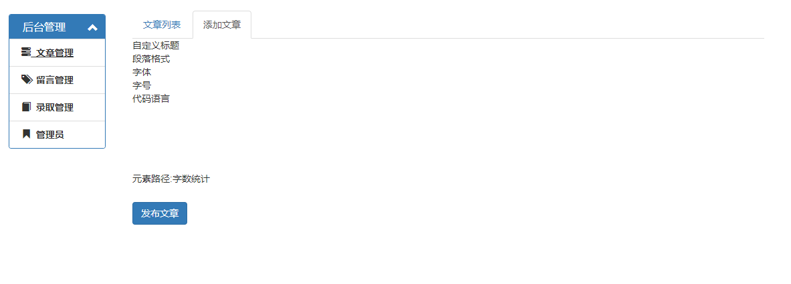

通过排查发现是因为样式在ajax中进行了添加，但是 却没有执行。将js文件在index.html中添加，然后显示正常。

然后又遇到新的问题，无法点击文章列表和添加文章切换。之前使用html方法，这个方法一直失败。后来使用了load方法九成宫了。这里浪费了好多的时间。但还是有问题，多次点击文章管理按钮，第二次以上添加文章中的ueditor样式显示还是异常。

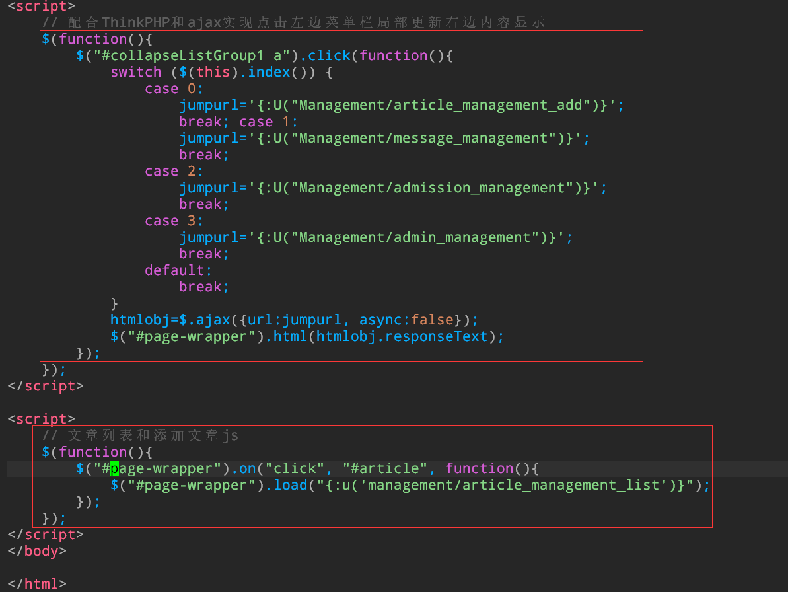

要被弄死了，简直浪费时间。ueditor中出现第一次加载成功，第二次失败的问题。失败截图如下：

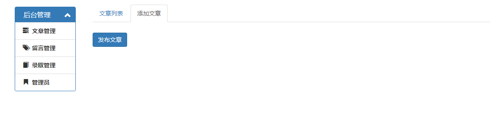

一开始以为是js中的load对script加载失败，查找很多资料都发现不是。后来怀疑是ueditor的问题。一看网上有很多的教程。常见的方法有以下两种：

```js
jQuery(function($) {
    UE.getEditor('_editor').render('_editor')
)}
       
jQuery(function($) {
    UE.delEditor('_editor');
    var ue = UE.getEditor('_editor');
)}
```

问题是：第一个会在第一次加载页面的时候生成两个编辑器。第二个方法直接失败。后来找到：[完美解决方法](https://blog.csdn.net/wslpeter1987/article/details/76530075)

```js
var editor = new UE.ui.Editor(opt);
editor.render(id1);
```

通过查看源代码找到getEditor()方法第一次是调用了ui方法，用于加载框架，再使用render方法创建编辑框。所以将其分开，可以让第二次加载的时候将缓存的ui重新生成一遍，这样就可以解决问题。

最终修改出来的添加文章页面如下：

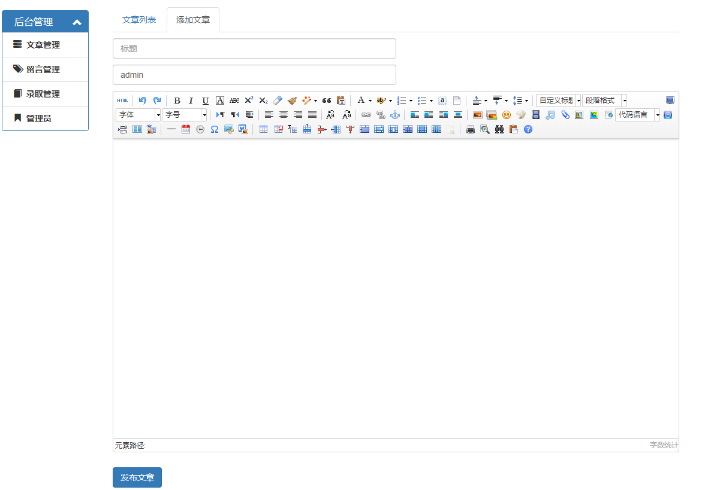


从添加文章页面添加内容保存到数据库成功，此时还没有设置附件选项。

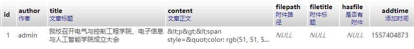

## 19.5.18 

实现查看、编辑、删除功能

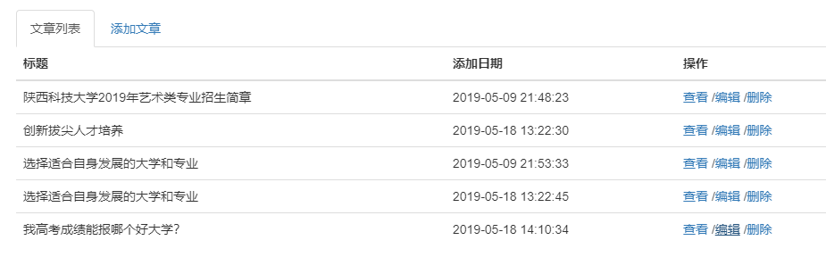

修改后台目录逻辑，将管理进行分离，这样方便管理。同时准备使用Model层对数据库进行访问。为了将业务逻辑解耦。

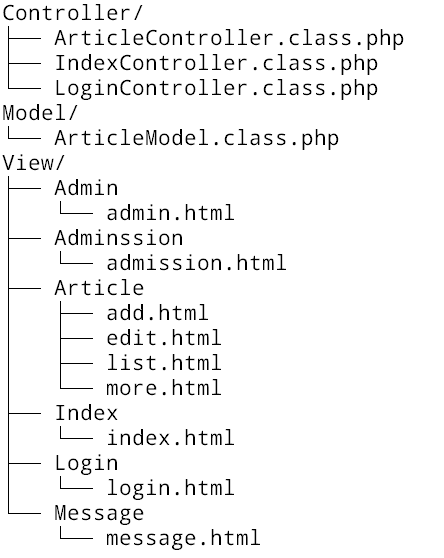

实现在首页显示前五个热点新闻：

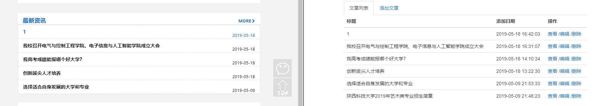

实现留言管理：

修改留言表如下：

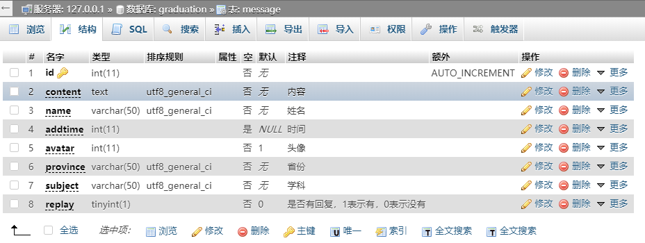

## 19.5.19

实现留言板的回复和显示功能

将留言回复添加到数据库：

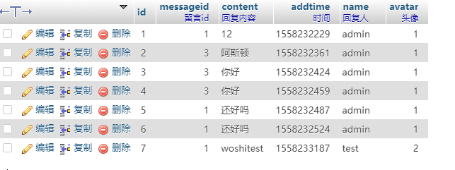

实现留言回复的显示：

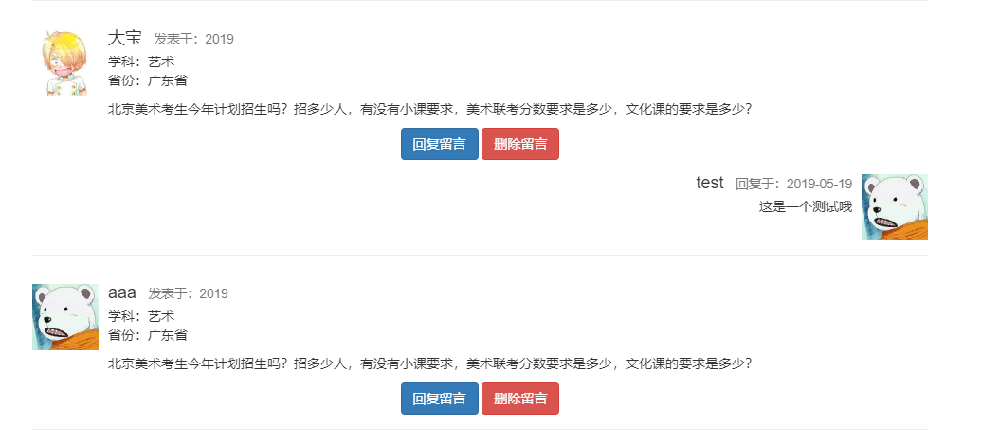

实现删除留言，会一起将留言及其回复一起删除：

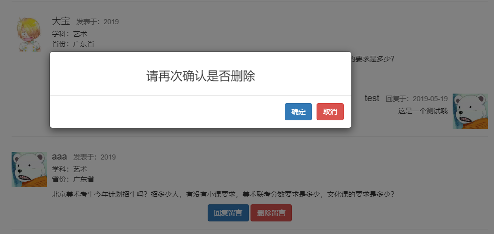

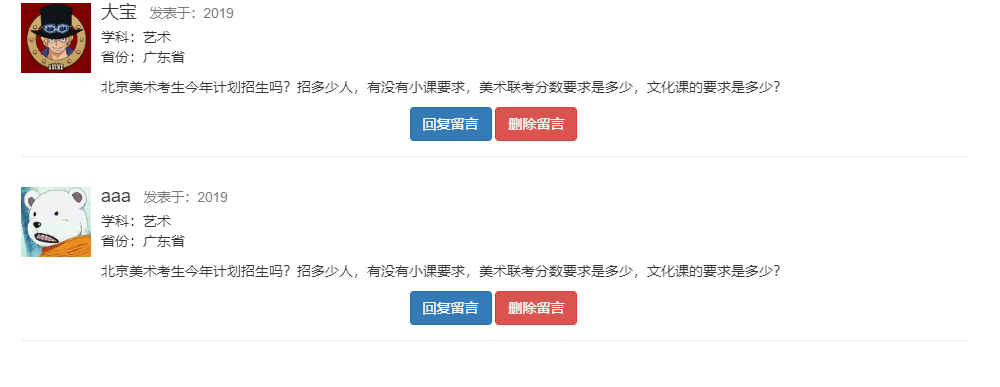

实现最新留言在首页的展示：

将下面的页面数据修改为从数据库中获取

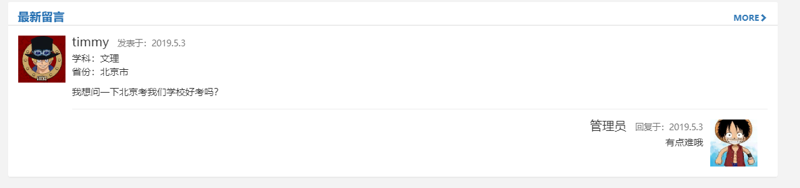

替换如下：

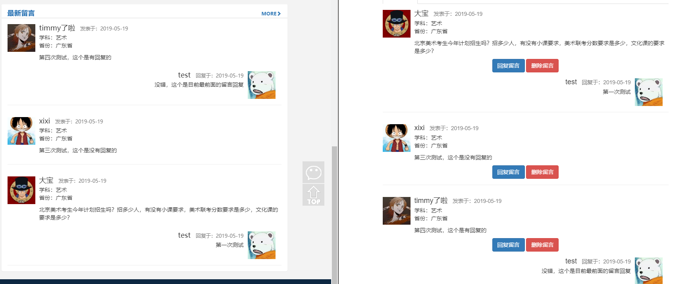


实现留言板展示及添加留言：

添加留言：

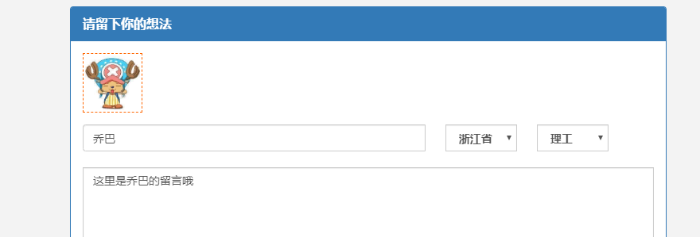

添加成功并展示：

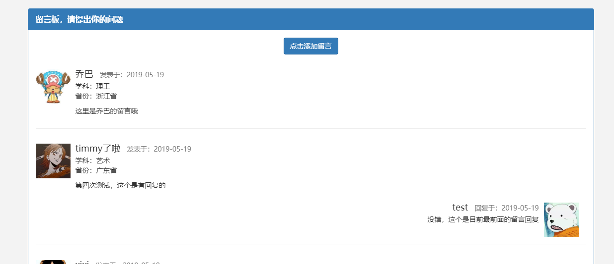

遇到一个问题：

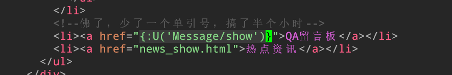

准备完成热点展示：

资讯列表展示	

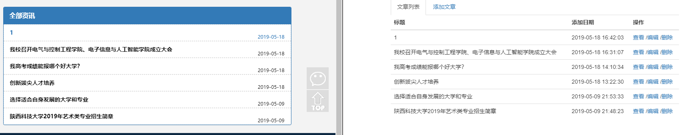

资讯详情查看：

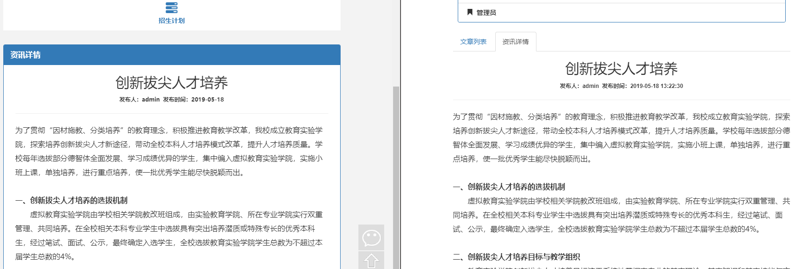

## 19.5.20

后台留言管理：

后台留言展示

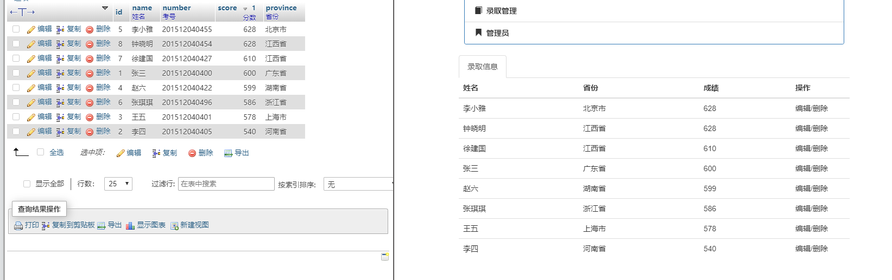

实现删除和编辑功能：


实现添加功能：

