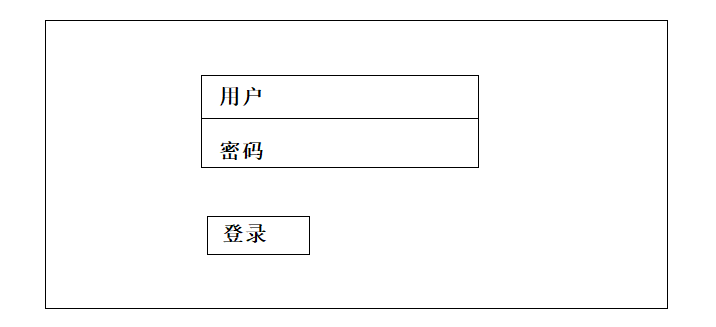

## 主要页面设计

> zzc

### 1 前端展示页面

#### 1.1 首页

首页基本布局：


最后设计首页的时候进行了修改，将精选QA留言放在最后，让资讯和学校里链接处于同一行，以7:5分栏。设计效果如下：

**19.4.29完成**


**19.4.30完成**

添加了侧栏，这个不太会弄，后来使用了position：fixed相对于浏览器窗口+div样式弄了一个。


修改导航栏，添加了二级菜单：


**19.5.1**对二级菜单有所修改：将之前的招生计划和录取情况合并。


添加了图片轮播功能，使用的是Bootstrap中的carousel组件，经过一定的格式修改：


其中的留言板块还需要修改，用于添加回复等样式，还不够完善。这里可以使用Bootstrap中的媒体对象试试

**19.5.4** 使用Bootstrap中的media组件进行了重新设计：


#### 1.2 学校简介

采用两分栏的形式，左边为导航目录，右边显示正文。


实现结果如下，但是文字的格式修改需要好长的时间去修改。还没有认真修改格式。	


#### 1.3 专业简介

下分三个子页面：专业介绍、课程介绍、师资力量

##### 专业介绍

这个页面跟学校简介相似度很高。


##### 课程介绍

课程介绍使用表格的形式体现。包括名称、时长、内容


**19.5.3完成**


##### 师资力量


**19.5.3完成**

这里遇到一个问题，头像不能居中，找了好多的方案都是失败的。使用了wordpress中的一个方法就成功了。这里记录下来：

```css
/* Alignment */
.alignleft {
 display: inline;
 float: left;
}
.alignright {
 display: inline;
 float: right;
}
.aligncenter {
 clear: both;
 display: block;
 margin:auto;
}
```

最后发现，Bootstrap中就有样式，thumbnail缩略图可以实现这个功能，所以直接换成这个样式更好用。然后添加了模态框，modal.js实现了点击弹窗的功能。


#### 1.4 信息查询界面

##### 往年录取计划及录取最低分


**19.5.1完成**

最后通过修改，实现了如下的实际内容：


##### 录取查询


**19.4.30完成 录取查询入口页面**

但是二维码有问题，这个位置放置的很不好，需要考虑如何让其更好处理。


感觉逻辑有点不清晰，需要梳理一下。


如果查询发现数据库中没有该考生信息，应该是弹窗提示没有该考生信息，然后让其重新输入。

**录取与未录取需要分开两个页面么？**暂时只实现了录取的页面，未录取的页面等到使用的时候在实现。

#### 1.5 QA留言板

**2019.5.4完成**

##### 留言浏览界面

留言板的设定是所有信息完全可以重复，用于单纯的留言使用。草图漏了一个，添加的时间，这个也是很重要的。


主要使用了media组件。


修改样式如下：


##### 留言发布界面

在这里，点击头像展示选择头像框花了很多的时候，没有遇到过类似的设定。只能通过查找资料完成这个页面。


#### 1.6 热点资讯


展示页面


新闻资讯详情页面


### 2 后端管理

#### 2.1 管理员登录



**2019.5.4完成**


#### 2.2 登录主页面


这里有问题：主要是a标签的hover不能很好的修改成想要的样式，这个小问题暂时先放下。


#### 2.3 管理员信息管理	

#### 2.4 文章管理

#### 2.5 录取信息管理

#### 2.6 QA留言管理